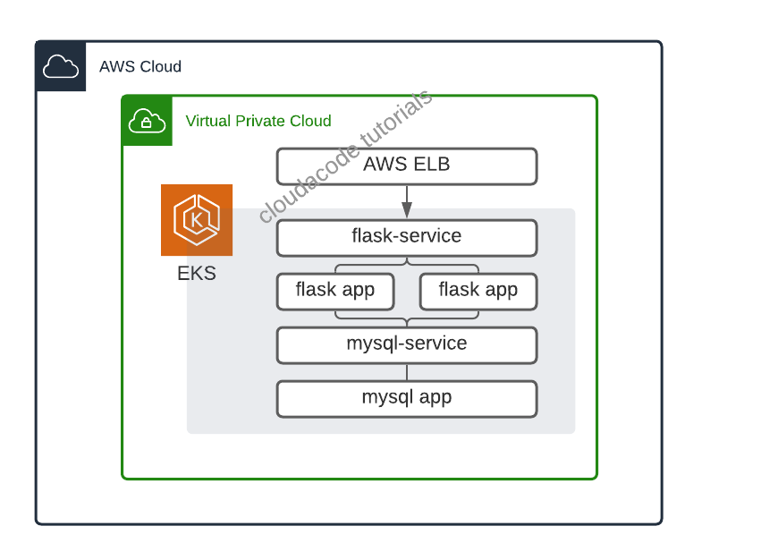

# Setup an Amazon EKS, Deploy web application

**EKS로 환경 구성 및 어플리케이션 배포 실습**

이번 실습은 Amazon EKS로 대규모 컨테이너 운영 환경을 만들고 서비스(Container)를 배포 배포 해보는 실습 입니다. AWS에서 쿠버네틱스 서비스인 EKS에 대해 배워 보고 컨테이너 서비스 배포를 위한 기본 작업들을 이해 할 수 있습니다.

## 사전 준비 사항

### AWS CLI 설정

AWS CLI 설치: [관련 링크](https://docs.aws.amazon.com/cli/latest/userguide/install-cliv2.html)

AWS CLI 초기 설정: [관련 링크](https://docs.aws.amazon.com/cli/latest/userguide/cli-configure-quickstart.html)

!!! note 
    원활한 실습을 위해 IAM User 권한에 `AdministratorAccess` policy 부여

## Architecture


<div>
<a id="channel-add-button" target="_blank" href="http://pf.kakao.com/_nxoaTs">
  
</a>
<a class="github-button" href="https://github.com/cloudacode/tutorials" data-icon="octicon-star" data-size="large" data-show-count="true" aria-label="Star cloudacode/tutorials on GitHub">Star</a>
</div>

## 1. EKS 구성 하기

### IAM user for EKS
EKS는 Root User로 생성/접속하는 것을 보안상 권고하지 않으며 EKS을 관리하기 위한 권한(Kubernetes RBAC authorization)을 EKS를 생성한 IAM 엔터티(user 혹은 role)로 부터 할당을 시키기 때문에 IAM user 혹은 role를 사용중이지 않다면 필수로 IAM 엔터티를 생성하고 EKS 생성 역할을 부여 해야한다. 

https://docs.aws.amazon.com/eks/latest/userguide/create-cluster.html

사용중인 IAM 엔터티(유저, Role)가 있다면 eksctl 권한이 있는지 검토. 원활한 실습을 위해 **AdministratorAccess** policy 부여

Otherwise, create a IAM user with eksctl minimum policies.
https://eksctl.io/usage/minimum-iam-policies/

현재 세션의 IAM 엔터티 확인 방법
```bash
$ aws sts get-caller-identity
```

### Install eksctl and kubectl

EKS 생성을 위해 eksctl을 설치 하고 추후 kubernetes 관리를 위해 kubectl도 사전에 설치 필요: [kubectl 설치(1.18)](https://docs.aws.amazon.com/ko_kr/eks/latest/userguide/install-kubectl.html)

[eksctl 설치](https://docs.aws.amazon.com/ko_kr/eks/latest/userguide/eksctl.html)


### Deploy EKS Cluster

EKS 배포를 위한 구성 정보 파일 (eks-cluster-config.yml) 작성

*실습 비용 절감을 위해 SPOT 인스턴스 사용

```yaml
---
apiVersion: eksctl.io/v1alpha5
kind: ClusterConfig

metadata:
  name: cloud-eks-cluster
  region: ap-northeast-2

availabilityZones: ["ap-northeast-2a", "ap-northeast-2c"]

iam:
  withOIDC: true

managedNodeGroups:
- name: cloud-eks-workers
  desiredCapacity: 1
  iam:
    withAddonPolicies:
      albIngress: true
  instanceTypes: ["c4.large","c5.large"]
  spot: true
#  instanceType: t3.small
#  ssh:
#    publicKeyName: "<your key pair name>"
#    https://ap-northeast-2.console.aws.amazon.com/ec2/v2/home?region=ap-northeast-2#KeyPairs:

cloudWatch:
    clusterLogging:
        enableTypes: ["audit", "authenticator", "controllerManager"]
```

정의한 구성 정보 대로 cluster 생성
```
$ eksctl create cluster -f ./eks-cluster-config.yml
```

EKS Cluster 구성 완료 까지 약 15분 소요

옵션)만약 CLI로 하고 싶다면 다음과 같이 수행
```
eksctl create cluster \
--name cloud-eks-01 \
--version 1.18 \
--region ap-northeast-2 \
--zones=ap-northeast-2a,ap-northeast-2c \
--nodegroup-name cloud-eks-workers \
--nodes 1 \
--nodes-min 1 \
--nodes-max 3 \
--with-oidc \
--managed \
--alb-ingress-access \
--spot \
--instance-types=c4.large,c5.large
```

### EKS Cluster 접속 확인

정상적인 output
```
[✔]  all EKS cluster resources for "cloud-eks-01" have been created
[ℹ]  nodegroup "cloud-eks-workers" has 1 node(s)
[ℹ]  node "ip-192-168-27-236.ap-northeast-2.compute.internal" is ready
[ℹ]  waiting for at least 1 node(s) to become ready in "cloud-eks-workers"
[ℹ]  nodegroup "cloud-eks-workers" has 1 node(s)
[ℹ]  node "ip-192-168-27-236.ap-northeast-2.compute.internal" is ready
[ℹ]  kubectl command should work with "/Users/kcchang/.kube/config", try 'kubectl get nodes'
[✔]  EKS cluster "cloud-eks-01" in "ap-northeast-2" region is ready
```

kubectl을 통해 추가된 node 확인
```
➜  ✗ kubectl get nodes
NAME                                                STATUS   ROLES    AGE   VERSION
ip-192-168-27-236.ap-northeast-2.compute.internal   Ready    <none>   19m   v1.18.9-eks-d1db3c
```

## 2. Application 배포

### Database 배포

[예제 todo 애플리케이션](https://github.com/cloudacode/coolstuff/tree/main/todo-flask-app)에서 로컬 sqlight DB 대신에 외부 RDBMS(mariadb, mysql등) 리소스를 연동 한 경우에는 쿠버네티스 위에 DB app을 배포 해야하므로 관련해 Deployment manifast 파일 작성

Deployment 파일 구성 하기 [kuberentes deployment](https://kubernetes.io/ko/docs/concepts/workloads/controllers/deployment/)

mysql-deployment.yaml
```yaml
apiVersion: apps/v1
kind: Deployment
metadata:
  name: mysql
spec:
  selector:
    matchLabels:
      app: mysql
  strategy:
    type: Recreate
  template:
    metadata:
      labels:
        app: mysql
    spec:
      containers:
      - image: cloudacode/mariadb-todo:v1.0.1
        name: mysql
        ports:
        - containerPort: 3306
          name: mysql
```


Deploy the contents of the deployment file:
```bash
kubectl apply -f mysql-deployment.yaml
```

Display information about the Deployment:
```bash
kubectl describe deployment mysql
```

정상적으로 mysql이 Deploy가 되었다면 flask app에서 mysql로 접속을 위해 service를 deployment에 매핑

mysql-service.yaml
```yaml
apiVersion: v1
kind: Service
metadata:
  name: mysql
spec:
  ports:
  - port: 3306
  selector:
    app: mysql
  clusterIP: None
```

Deploy the contents of the service file:
```bash
kubectl apply -f mysql-service.yaml
```

배포가 정상적으로 완료가 되면 Pod 정보를 찾을수 있다
```bash
kubectl get pods -l app=mysql
```

Output
```bash
NAME                     READY   STATUS    RESTARTS   AGE
mysql-6fd94cc949-d8lj7   1/1     Running   0          23s
```

### Flask APP 배포

쿠버네티스에 Flask app을 배포하기 위해 Deployment manifast 파일 작성

flask-deployment.yaml
```yaml
apiVersion: apps/v1
kind: Deployment
metadata:
  name: cloud-flask
  labels:
    app: cloud-flask
spec:
  replicas: 1
  selector:
    matchLabels:
      app: cloud-flask
  strategy:
    rollingUpdate:
      maxSurge: 20%
      maxUnavailable: 20%
    type: RollingUpdate
  template:
    metadata:
      labels:
        app: cloud-flask
    spec:
      containers:
      - image: cloudacode/python-todo:v1.1.0
        imagePullPolicy: Always
        name: cloud-flask
        ports:
        - containerPort: 5000
          protocol: TCP
        env:
        - name: DB_USER
          value: root
        - name: DB_PASSWORD
          value: mysecret
        - name: DB_NAME
          value: todo
        - name: DB_HOST
          value: mysql
```

Deploy the contents of the deployment file:
```bash
kubectl apply -f flask-deployment.yaml
```

Display information about the Deployment:
```bash
kubectl describe deployment cloud-flask
```


정상적으로 Flask app이 배포 되었다면 외부에서 flask app으로 접속을 위해 service를 deployment에 매핑

flask-service.yaml
```yaml
apiVersion: v1
kind: Service
metadata:
  name: cloud-flask-svc
spec:
  selector:
    app: cloud-flask
  ports:
   -  protocol: TCP
      port: 80
      targetPort: 5000
  type: LoadBalancer
```

Deploy the contents of the service file:
```bash
kubectl apply -f flask-service.yaml
```

배포가 정상적으로 완료가 되면 Pod 정보를 찾을수 있다
```bash
kubectl get pods -l app=cloud-flask
```

flask app의 경우는 Service 타입을 LB로 외부 노출을 시켰으므로 다음과 같이 LB Endpoint를 확인 가능
```bash
kubectl get svc cloud-flask-svc
```

Output
```bash
NAME              TYPE           CLUSTER-IP       EXTERNAL-IP                                                                   PORT(S)        AGE
cloud-flask-svc   LoadBalancer   10.100.211.215   acd2f9103b9564eb3ada544282a1dee3-566651492.ap-northeast-2.elb.amazonaws.com   80:31126/TCP   101s 
```

해당 LB endpoint로 접근 하여 확인 동작 확인


## Clean Up
실습 완료 후 비용 절약을 위해 실습한 EKS 리소스를 정리
```
eksctl delete cluster --region=ap-northeast-2 --name=<your eks cluster name>
```

## Trobleshooting - EKS
https://aws.amazon.com/premiumsupport/knowledge-center/amazon-eks-cluster-access/

https://docs.aws.amazon.com/ko_kr/eks/latest/userguide/troubleshooting.html#unauthorized

이 글이 유용하였다면 ⭐ Star를, 💬 1:1 질문이나 기술 관련 문의가 필요하신 분들은 클라우드어코드 카카오톡 채널 추가 부탁드립니다.🤗

<div>
<a id="channel-add-button" target="_blank" href="http://pf.kakao.com/_nxoaTs">
  
</a>
<a class="github-button" href="https://github.com/cloudacode/tutorials" data-icon="octicon-star" data-size="large" data-show-count="true" aria-label="Star cloudacode/tutorials on GitHub">Star</a>
</div>

<script async defer src="https://buttons.github.io/buttons.js"></script>
