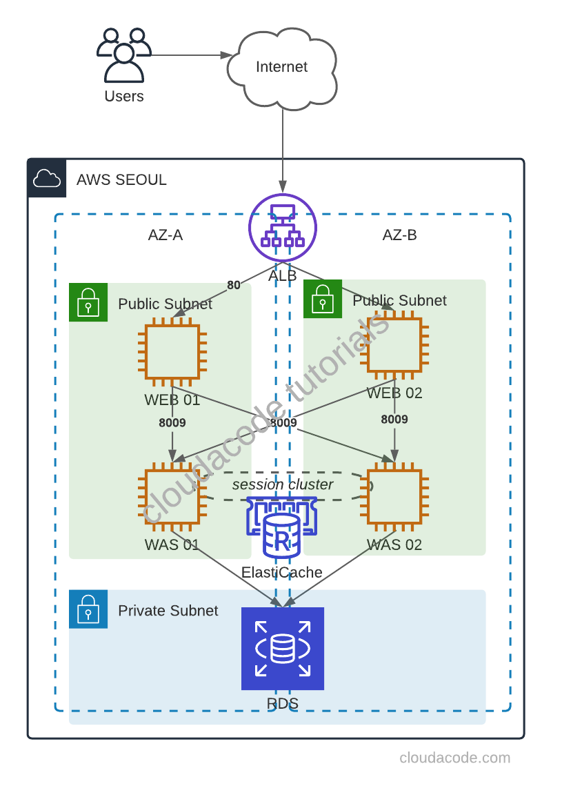
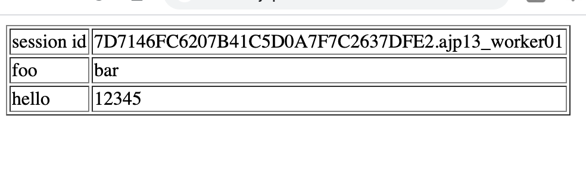

# Build a 3tier Web App on AWS

The basic unit of a 3 tier web application which is Apache + Tomcat + Redis + DB and we will use Redis for tomcat session clustering.

WEB(Apache), WAS(Tomcat) + Session Clustering(Redis), DB 구성을 통해 기본적인 웹서비스의 3 Tier 구성에 대해 알아본다. 

This tutorial uses the AWS and highly recommend using AWS for setting up the infrastructure to test 3 tier web app.

**Time to Complete: 2-3 hours**

**Cost to Complete: Many of the services used are included in the AWS Free Tier. For those that are not, the sample application will cost, in total, less than $2/day.**

**Tutorial Prereqs:**

* **An AWS Account and Administrator-level or PowerUser-level access to it**

Please be sure to terminate all of the resources created during this workshop to ensure that you are no longer charged.

### System Architecture


## 1. Create a Web Server

### Create EC2 instances

First, create `Ubuntu 18.04` [EC2](https://ap-northeast-2.console.aws.amazon.com/ec2/v2/home) instance(s) for Web Server(s), with public IP and allow 80 for any.  

### Install Apache on Ubuntu 18.04

Install via apt package

```bash
$ sudo apt update
$ sudo apt install apache2
```

## 2. Create a WAS Server

### Create EC2 instances

First, create `Ubuntu 18.04` [EC2](https://ap-northeast-2.console.aws.amazon.com/ec2/v2/home) instance(s) for Was Server(s), with public IP, allow 8080 for any, and allow 8009 for WEB server SG group.  

### Set up a Tomcat User
!!! note
    Tomcat should be run as an unprivileged user (i.e. not root)

```bash
$ sudo groupadd tomcat
$ sudo useradd -s /bin/false -g tomcat -d /opt/tomcat tomcat
```

### Install Tomcat via Source package

First, Tomcat needs JDK
```bash
$ sudo apt update
$ sudo apt install default-jdk -y
$ sudo update-java-alternatives -l
```

Download Tomcat Source package [Download](https://tomcat.apache.org/download-90.cgi)
```bash
$ curl -O https://ftpmirror1.infania.net/mirror/apache/tomcat/tomcat-9/v9.0.41/bin/apache-tomcat-9.0.41.tar.gz
```

Execute the following command to create tomcat directory and extract source pakcage

```bash
$ sudo mkdir /opt/tomcat
$ sudo tar xzvf apache-tomcat-*tar.gz -C /opt/tomcat --strip-components=1
```

Set up the permission for tomcat user/group

```bash
cd /opt/tomcat
sudo chgrp -R tomcat /opt/tomcat
sudo chmod -R g+r conf
sudo chmod g+x conf
sudo chown -R tomcat webapps/ work/ temp/ logs/
```

Now, configure the systemd service file `/etc/systemd/system/tomcat.service`

```bash
[Unit]
Description=Apache Tomcat Web Application Container
After=network.target

[Service]
Type=forking

Environment=JAVA_HOME=/usr/lib/jvm/java-1.11.0-openjdk-amd64
Environment=CATALINA_PID=/opt/tomcat/temp/tomcat.pid
Environment=CATALINA_HOME=/opt/tomcat
Environment=CATALINA_BASE=/opt/tomcat
Environment='CATALINA_OPTS=-Xms512M -Xmx1024M -server -XX:+UseParallelGC'
Environment='JAVA_OPTS=-Djava.awt.headless=true -Djava.security.egd=file:/dev/./urandom'

ExecStart=/opt/tomcat/bin/startup.sh
ExecStop=/opt/tomcat/bin/shutdown.sh

User=tomcat
Group=tomcat
UMask=0007
RestartSec=10
Restart=always

[Install]
WantedBy=multi-user.target
```

Start tomcat service
```bash
sudo systemctl daemon-reload
sudo systemctl start tomcat
sudo systemctl status tomcat
```

Open your browser to check tomcat server
http://was_server_IP:8080

Congratulations, you have installed the basic tomcat server

### Create sample Webapp in Tomcat

```bash
$ cd /opt/tomcat
$ sudo mkdir -p webapps/demo
```

`index.jsp`
```html
<html>
  <body>
    TOMCAT DEMO
  </body>
</html>
```

Restart tomcat service

```bash
$ sudo systemctl restart tomcat.service
```

http://WAS_SERVER_IP:8080/demo

Now, you have a new demo webapp


## 3. Integrate apache and tomcat via AJP protocol

!!! note
    Tomcat AJP protocol connector
    https://tomcat.apache.org/tomcat-7.0-doc/config/ajp.html

### Enable AJP in Tomcat server

In order to make connection between apache and tomcat, enable AJP connector in `/opt/tomcat/conf/server.xml`

```xml
    <!-- Define an AJP 1.3 Connector on port 8009 -->
    <Connector protocol="AJP/1.3"
               address="0.0.0.0"
               secretRequired="false"
               port="8009"
               redirectPort="8443" />

    <Engine name="Catalina" defaultHost="localhost" jvmRoute="ajp13_worker01">
```

Please keep in mind, the jvmRoute value stands for worker name and each WAS has a unique name.

Restart tomcat service
```bash
$ sudo systemctl restart tomcat.service
```

### Setup mod_jk module in Apache server

Install mod_jk library

```bash
$ cd /etc/apache2
$ sudo apt-get install libapache2-mod-jk
$ sudo ln -s  /etc/libapache2-mod-jk/workers.properties
```

Configure worker infomation as WAS server in `workers.properties`

Single WAS server,
```log
workers.tomcat_home=/usr/share/tomcat8
workers.java_home=/usr/lib/jvm/default-java
ps=/

worker.list=ajp13_worker_lb

worker.ajp13_worker01.port=8009
worker.ajp13_worker01.host=`WAS Server IP`
worker.ajp13_worker01.type=ajp13
worker.ajp13_worker01.lbfactor=100

worker.ajp13_worker_lb.type=lb
worker.ajp13_worker_lb.balance_workers=ajp13_worker01
```

Multiple WAS servers,

```log
workers.tomcat_home=/usr/share/tomcat8
workers.java_home=/usr/lib/jvm/default-java
ps=/

worker.list=ajp13_worker_lb

worker.ajp13_worker01.port=8009
worker.ajp13_worker01.host=`WAS Server01 IP`
worker.ajp13_worker01.type=ajp13
worker.ajp13_worker01.lbfactor=50

worker.ajp13_worker02.port=8009
worker.ajp13_worker02.host=`WAS Server02 IP`
worker.ajp13_worker02.type=ajp13
worker.ajp13_worker02.lbfactor=50

worker.ajp13_worker_lb.type=lb
worker.ajp13_worker_lb.balance_workers=ajp13_worker01,ajp13_worker02
```

!!! note 
    Loadbalancing
    https://tomcat.apache.org/connectors-doc/common_howto/loadbalancers.html

In order to forward traffic to tomcat, add JkMount configuration in site default file(`/etc/apache2/sites-enabled/000-default.conf`)

```xml
<VirtualHost *:80>
        ServerAdmin localhost
        DocumentRoot /var/www/html
        JkMount /*.jsp ajp13_worker_lb
        ErrorLog ${APACHE_LOG_DIR}/error.log
        CustomLog ${APACHE_LOG_DIR}/access.log combined
</VirtualHost>
```

Restart Apache service
```bash
$ sudo systemctl restart apache.service
```

Now, the Apache forwards JSP request to Tomcat and response

http://WEB_SERVER_IP:8080/demo/index.jsp

Congratulations, you have integrated WEB, WAS tier


## 4. Tomcat Session Clustering with Redis

We have several options to set up the session clustering, and this tutorial is going to use [Redisson-tomcat](https://github.com/redisson/redisson/tree/master/redisson-tomcat) library which is the most active library for Redis session clustering.

### Create the ElastiCache cluster 
First, create Redis via [ElastiCache](https://ap-northeast-2.console.aws.amazon.com/elasticache/home) cluster, and allow 6379 for WAS server SG group. 

### Setup the Redisson library
Download `redisson-all`, `redisson-tomcat` library in tomcat lib directory

```bash
$ sudo curl -O https://repository.sonatype.org/service/local/repositories/central-proxy/content/org/redisson/redisson-all/3.15.0/redisson-all-3.15.0.jar

$ sudo curl -O https://repository.sonatype.org/service/local/repositories/central-proxy/content/org/redisson/redisson
-tomcat-9/3.15.0/redisson-tomcat-9-3.15.0.jar

$ sudo mv redisson* /opt/tomcat/lib/
```

Add the redisson class in `conf/context.xml` 
```xml
<Manager className="org.redisson.tomcat.RedissonSessionManager"
  configPath="${catalina.base}/conf/redisson.conf"
  readMode="REDIS" updateMode="DEFAULT" broadcastSessionEvents="false"
  keyPrefix=""/>
```

Setup the `conf/redisson.conf` 
```log
{
"singleServerConfig":{
  "address": "redis://`ElastiCache_Cluster`:6379"
},
"threads":0,
"nettyThreads":0,
"transportMode":"NIO"
}
```

Restart tomcat service
```bash
$ sudo systemctl restart tomcat.service
```

Now, you can check session information in Redis

If you don't have `redis-client`, install redis-tools apt package
```bash
apt-get install redis-tools
```

Access redis cluster and check keys which are the session ID.
```bash
$ redis-cli -h session01.mvqc4c.0001.apn2.cache.amazonaws.com

session01.mvqc4c.0001.apn2.cache.amazonaws.com:6379> KEYS *
1) "redisson:tomcat_session:959CB3E05C307CB9ECCEB4534E84CFE8.ajp13_worker01"
2) "redisson:tomcat_session:7616482947EC5AC55A6ACDFF5F4BEC01.ajp13_worker02"
```

Add following JSP file to check via browser

`webapps/demo/session.jsp`
```html
<html>
  <body>
    <table border="1">
      <tr>
        <td>Session ID</td>
        <td><%=session.getId()%></td>
      </tr>
      <tr>
        <td>Server IP</td>
        <td><%=request.getLocalAddr()%></td>
      </tr>
    </table>
    <div>Server Name: <b><%=request.getLocalName()%></b></div>
  </body>
</html>
```

Restart apache2 service
```bash
$ sudo systemctl restart apache2
```

http://WEB_SERVER_IP/demo/session.jsp

Please stop one of the tomcat servers and check the session is still in place
Congratulations, you have integrated Session Clustering

## 5. Implement Database

### Deploy a RDS  
First, create Mysql via [RDS](https://ap-northeast-2.console.aws.amazon.com/rds/home), and allow 3306 for WAS server SG group. 

### Create a dummy database

Access RDS and create a Dummy database
```
create database javatest;
use javatest;
create table testdata (id int not null auto_increment primary key, foo varchar(25), bar int);
```

```
insert into testdata values(null, 'hello', 12345);
select * from testdata;
```

### Setup mysql connector for Tomcat

In order to connect mysql, add mysql connector in the WAS(Tomcat) server(s) 
```bash
$ cd tmp/

$ curl -O https://cdn.mysql.com//Downloads/Connector-J/mysql-connector-java-8.0.23.zip

$sudo mv /tmp/mysql-connector-java-8.0.23/mysql-connector-java-8.0.23.jar /opt/tomcat/lib/
```

Update conf/context.xml
```bash
<Resource name="jdbc/TestDB" auth="Container" type="javax.sql.DataSource" maxActive="100" maxIdle="30" maxWait="10000" username="DB_USERNAME" password="DB_PASSWORD" driverClassName="com.mysql.jdbc.Driver" url="jdbc:mysql://RDS_ENDPOINT:3306/javatest"/>
```
Please change the `DB_USERNAME`, `DB_PASSWORD`, and `RDS_ENDPOINT`

Add following JSP file in the `webapps/demo/testdb.jsp` to check via browser
```jsp
<%@page import="java.sql.DriverManager"%> 
<%@page import="java.sql.ResultSet"%>
<%@page import="java.sql.Statement"%>
<%@page import="java.sql.Connection"%> 
<%
String id = request.getParameter("userid"); String driver =
"com.mysql.jdbc.Driver"; String connectionUrl =
"jdbc:mysql://RDS_ENDPOINT:3306/";
String database = "javatest"; String userid = "DB_USERNAME"; String password =
"DB_PASSWORD"; try { Class.forName(driver); } catch (ClassNotFoundException e) {
e.printStackTrace(); } Connection connection = null; Statement statement = null;
ResultSet resultSet = null; %>
<!DOCTYPE html>
<html>
  <body>
    <table border="1">
      <tr>
        <td>session id</td>
        <td><%=session.getId()%></td>
      </tr>
      <tr>
        <td>foo</td>
        <td>bar</td>
      </tr>
      <% try{ connection = DriverManager.getConnection(connectionUrl+database,
      userid, password); statement=connection.createStatement(); String sql
      ="select id, foo, bar from testdata"; resultSet =
      statement.executeQuery(sql); while(resultSet.next()){ %>
      <tr>
        <td><%=resultSet.getString("foo") %></td>
        <td><%=resultSet.getString("bar") %></td>
      </tr>
      <% } connection.close(); } catch (Exception e) { e.printStackTrace(); } %>
    </table>
  </body>
</html>
```

Restart apache2 service
```bash
$ sudo systemctl restart tomcat.service
```

Now, this testdb.jsp will return the DB result which is in the RDS

http://WEB_SERVER_IP/demo/testdb.jsp



Congratulations, you have completed WEB, WAS, DB tutorial

## Reference
- https://www.digitalocean.com/community/questions/apache-virtual-host-with-multiple-tomcat-server
- https://github.com/redisson/redisson/wiki/2.-Configuration#221-yaml-file-based-configuration