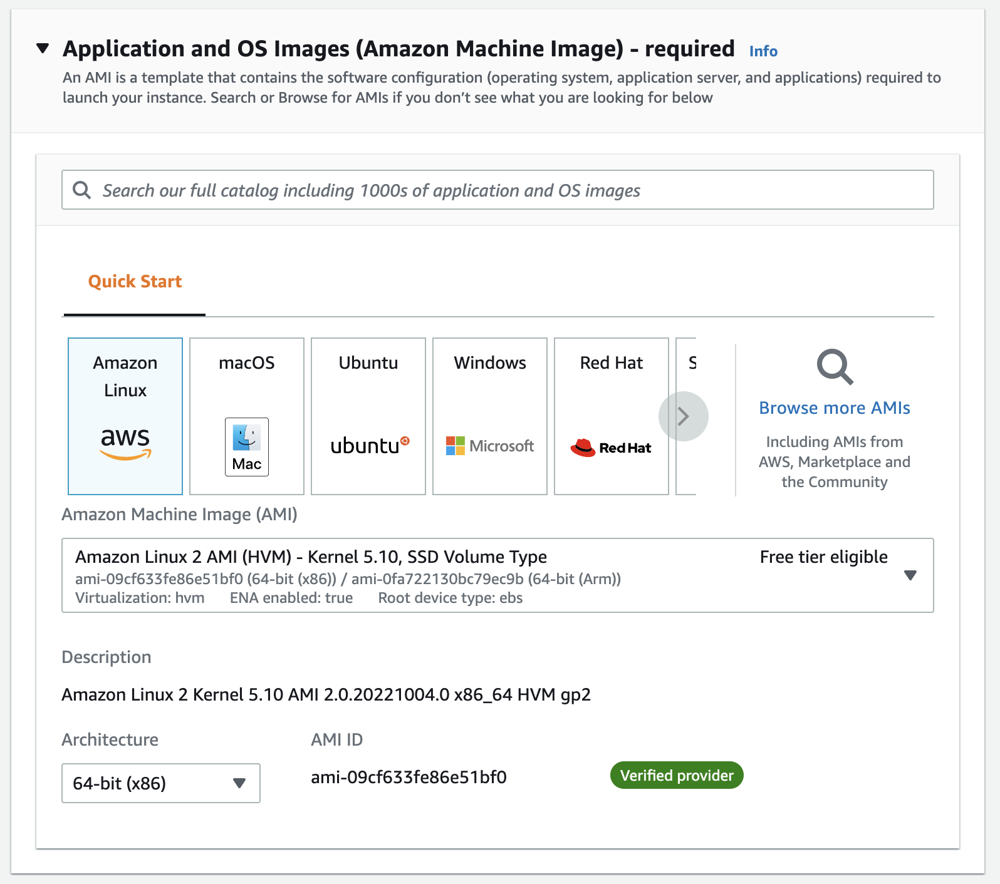
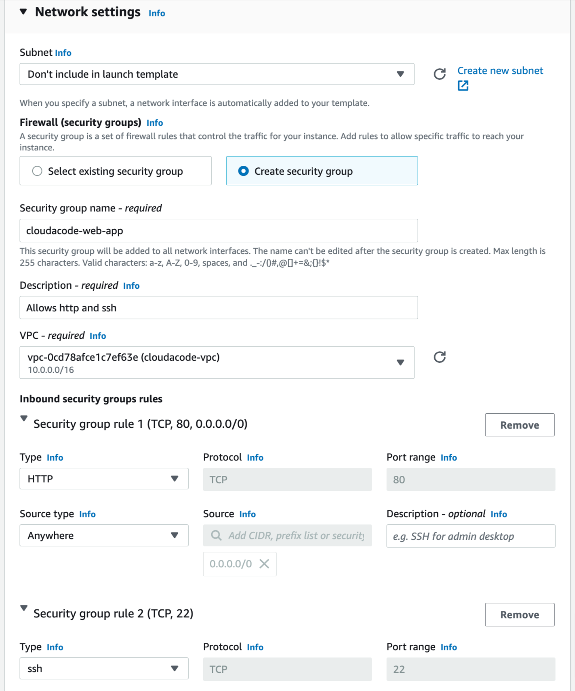
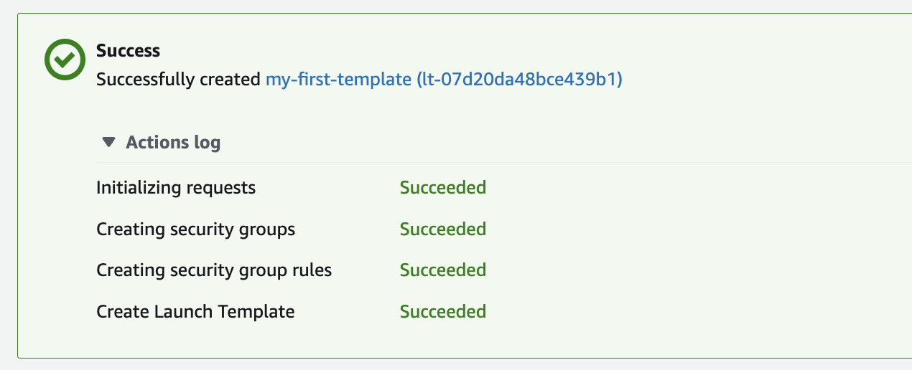
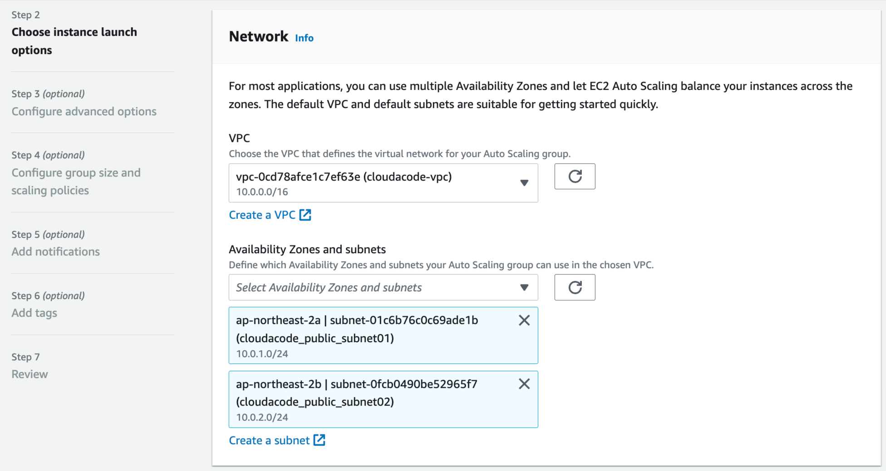
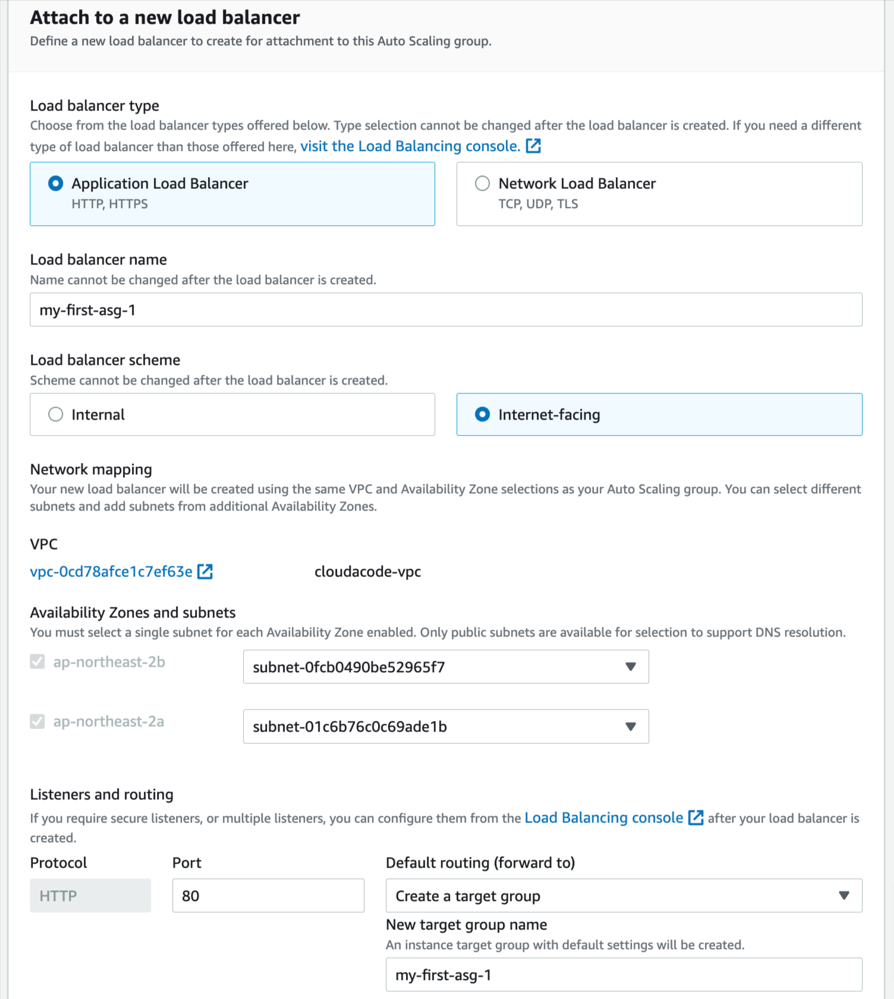
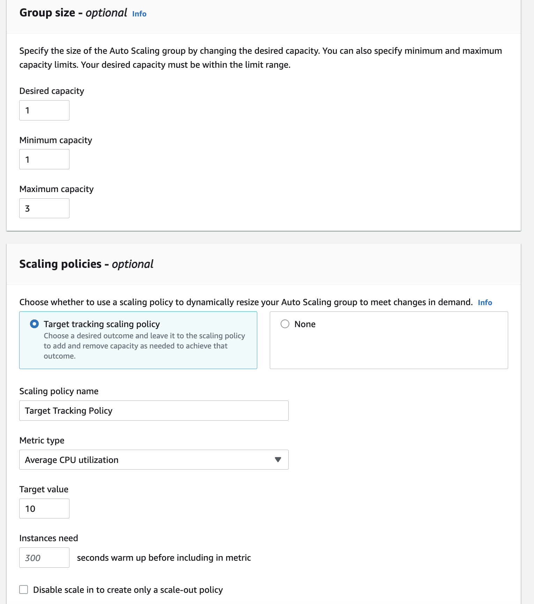
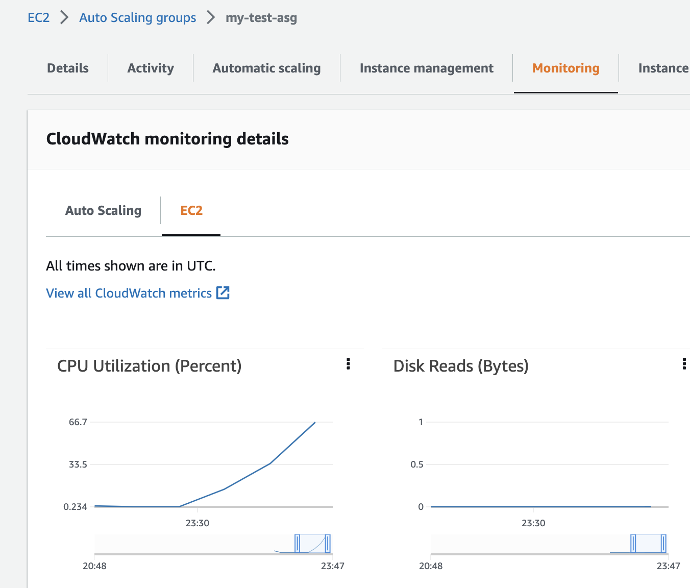
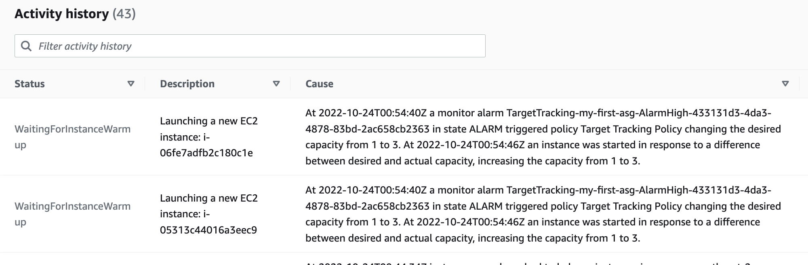
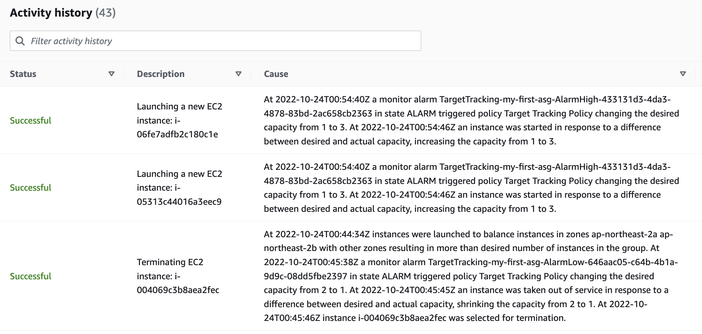
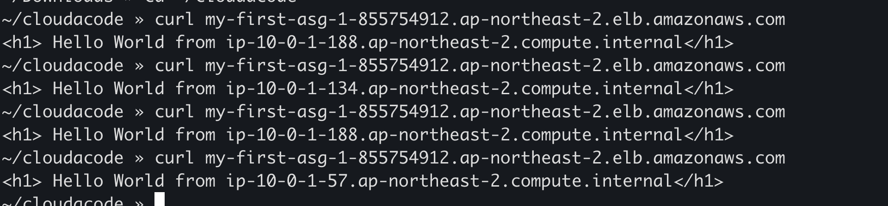

# Amazon EC2 Auto Scaling

**Amazon EC2 Auto Scaling 구성 실습**

이번 실습은 Amazon EC2 Auto Scaling을 통해 리소스 사용량에 맞게 자동 확장 축소를 해보는 실습입니다. AWS에서 가장 기본이 되는 EC2를 탄력적으로 운영하는 방법과 Auto Scaling 설정 구성을 이해할 수 있습니다.


**Time to Complete: 0.5 hours**

<div>
<a id="channel-add-button" target="_blank" href="http://pf.kakao.com/_nxoaTs">
  
</a>
<a class="github-button" href="https://github.com/cloudacode/tutorials" data-icon="octicon-star" data-size="large" data-show-count="true" aria-label="Star cloudacode/tutorials on GitHub">Star</a>
</div>

**Tutorial Prereqs:**

* **An AWS Account and Administrator-level or PowerUser-level access to it**

## 1. Launch Template 구성

### Launch Template 설정

[Launch Template 생성 페이지](https://ap-northeast-2.console.aws.amazon.com/ec2/home?region=ap-northeast-2#LaunchTemplates:)

- 시작 템플릿의 이름을 입력하고 초기 버전에 대한 설명을 추가
- Autoscaling에서 활용할 Template이므로 Auto Scaling guidance 활성화
- EC2 Image 설정

- Instance type: t2.nano (512 MB RAM, 1 vCPUs)
- Key pair: 기존에 EC2 접속때 사용하던 key 선택 (없다면 생성 가능)
- Network Settings

- Storage: Default
- Advanced Details > User data
```bash
#!/bin/bash
yum update -y
yum install -y httpd
echo "<h1> Hello World from $(hostname -f)</h1>" > /var/www/html/index.html
systemctl start httpd
systemctl enable httpd
```




[LaunchTemplate AWS 콘솔](https://ap-northeast-2.console.aws.amazon.com/ec2/home?region=ap-northeast-2#LaunchTemplates:) 에서 확인 가능

## 2. Auto Scaling Groups 구성

### Auto Scaling Groups 설정

[Auto Scaling Group 생성 페이지](https://ap-northeast-2.console.aws.amazon.com/ec2/home?region=ap-northeast-2#AutoScalingGroups:)

- Auto Scaling 그룹 이름 입력 및 Launch template(시작 템플릿) 선택
- Network

- Advanced option 에서 LoadBalancer 추가

- Min/Max 값 설정 및 CPU Trigger policy를 10으로 조정

- Review 및 Create Autoscaling group 진행

## 3. 서비스 확인

[LoadBalancer 콘솔](https://ap-northeast-2.console.aws.amazon.com/ec2/home#LoadBalancers:sort=loadBalancerName)에서 LB 및 [EC2 콘솔](https://ap-northeast-2.console.aws.amazon.com/ec2/)에서 1개의 instance가 생성 됬는지 확인

!!! WARN
    생성된 LB의 Default Security Group의 Rule에 80 port가 열려있지 않다면 수동으로 추가 필요

LB와 EC2의 상태가 `RUNNING` 으로 변경 되었으면 `Public DNS or IP`로 서비스 접속

해당 `URL`을 브라우저에서 접속하여 정상적으로 서비스 중인지 확인

```bash
curl my-first-asg-1-190530202.ap-northeast-2.elb.amazonaws.com

<h1> Hello World from ip-10-0-1-132.ap-northeast-2.compute.internal </h1>
```

## 4. 부하 생성

AutoScaling Group이 설정 한 대로 운영이 되는지 확인을 위해 만들어진 EC2 인스턴스에 Stress test 진행

[EC2 콘솔](https://ap-northeast-2.console.aws.amazon.com/ec2/)에서 생성된 instance로 SSH 접속

```bash
# install stress on Amazon Linux
sudo amazon-linux-extras install epel -y
sudo yum install stress -y

# run CPU stress
sudo stress -c 70
```

ASG 콘솔 Monitoring 탭에서 EC2 instance의 CPU가 올라가는 것을 확인 가능


Activity log에서 자동으로 scaling이 되는 것을 확인



LB Endpoint에서 새로운 인스턴스(총 3대)로 트레픽이 벨런싱 되는지 확인


## 5. 환경 삭제

[Auto Scaling 그룹](https://console.aws.amazon.com/ec2/v2/home?#AutoScalingGroups)을 삭제

[LoadBalancer 콘솔](https://ap-northeast-2.console.aws.amazon.com/ec2/home#LoadBalancers:sort=loadBalancerName)에서 LB 삭제

🎉 Congratulations, you have completed AWS Autoscaling Tutorial

이 글이 유용하였다면 ⭐ Star를, 💬 1:1 질문이나 기술 관련 문의가 필요하신 분들은 클라우드어코드 카카오톡 채널 추가 부탁드립니다.🤗

<div>
<a id="channel-add-button" target="_blank" href="http://pf.kakao.com/_nxoaTs">
  
</a>
<a class="github-button" href="https://github.com/cloudacode/tutorials" data-icon="octicon-star" data-size="large" data-show-count="true" aria-label="Star cloudacode/tutorials on GitHub">Star</a>
</div>

<script async defer src="https://buttons.github.io/buttons.js"></script>
