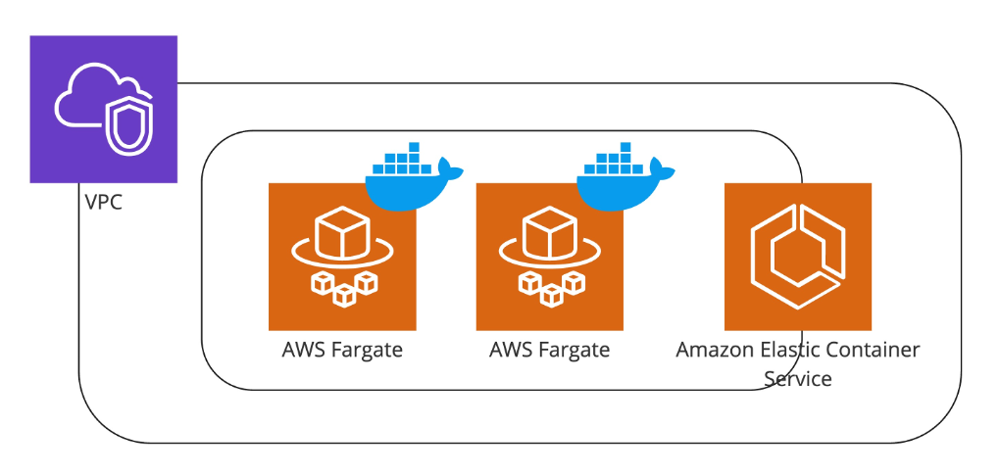
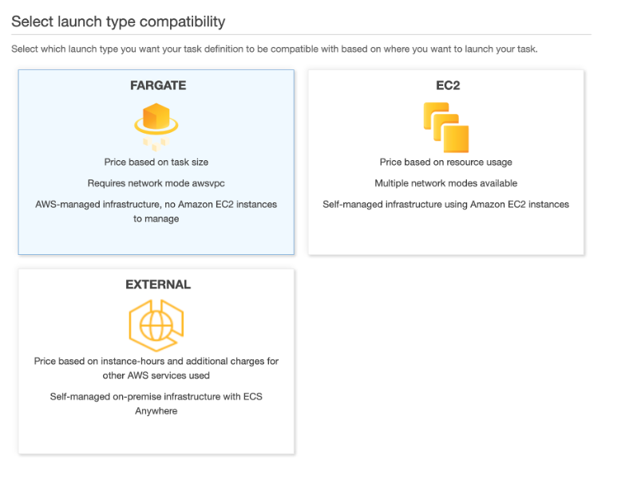
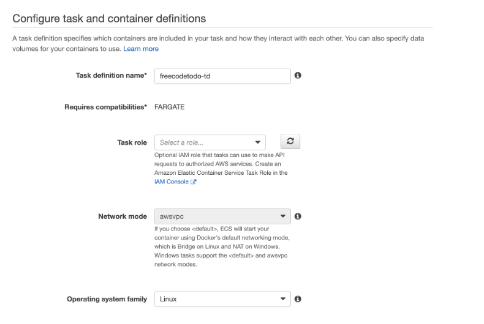
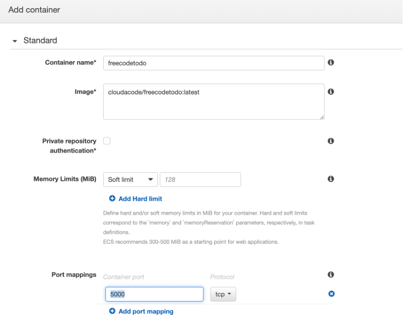
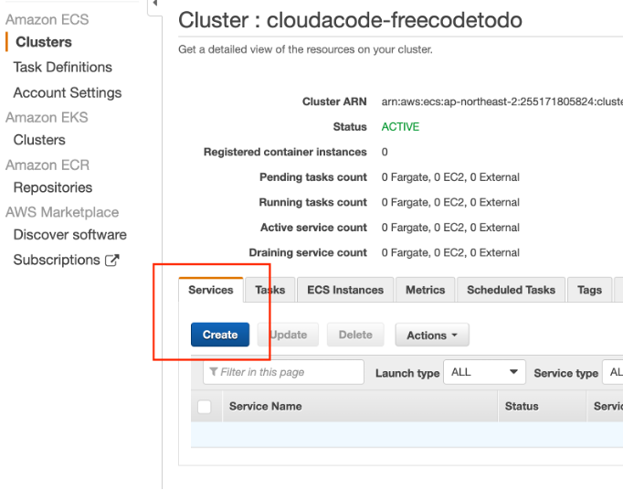
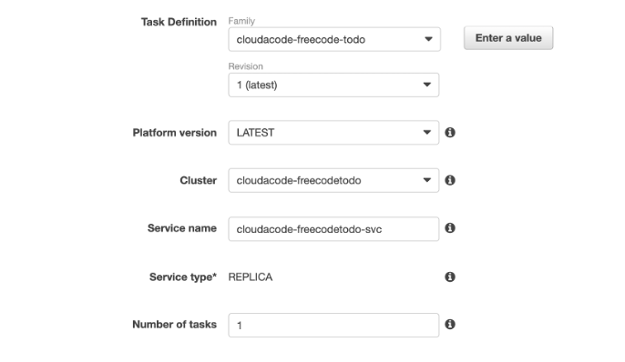
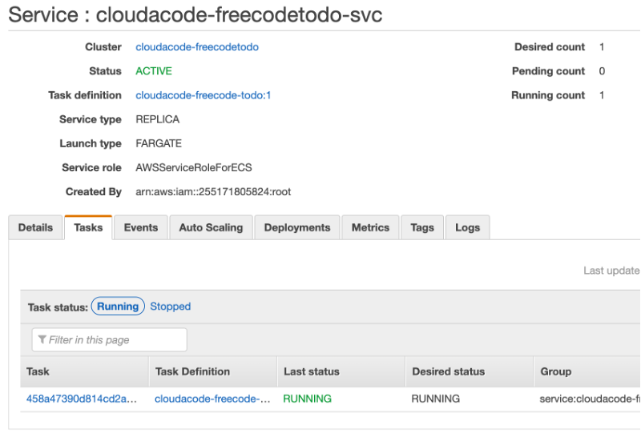
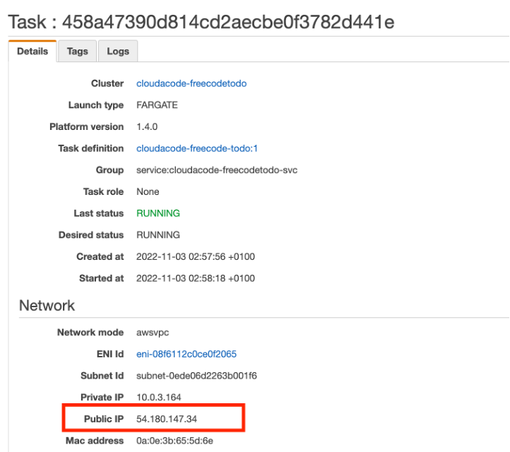
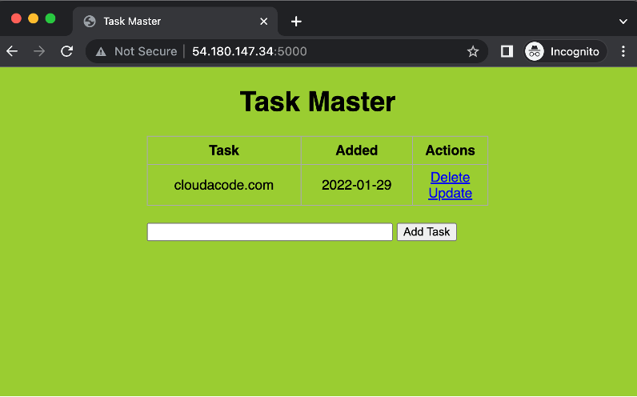

# Deploy Container on Elastic Container Service

**Amazon ECS를 통해 Container 배포**

이번 실습은 Amazon ECS 통해 Container를 배포하고 접근을 해보는 실습 입니다. AWS Elastic Container Service의 Cluster, Service의 직접 구성을 통해 프러덕션 어플리케이션을 구성 하고 관리 하는 방법을 이해 할 수 있습니다

**Time to Complete: 0.5 hours**

<a class="github-button" href="https://github.com/cloudacode/tutorials" data-icon="octicon-star" data-size="large" data-show-count="true" aria-label="Star cloudacode/tutorials on GitHub">Star</a>

**Tutorial Prereqs:**

* **An AWS Account and Administrator-level or PowerUser-level access to it**
* **본인이 생성한 컨테이너 이미지** [freecode-todo](https://hub.docker.com/repository/docker/cloudacode/freecodetodo), [소스 코드](https://github.com/cloudacode/FlaskIntroduction)

## 1. Task Definitions 설정

하나 혹은 여러 개의 Container로 구성된 하나의 어플리케이션을 Task정의로 지정 하며 Task 단위로 ECS에 배포

ECS Dashboard 에서 [Task Definitions](https://ap-northeast-2.console.aws.amazon.com/ecs/home/taskDefinitions) 선택 후 **Create new Task Definition**

- Task Definition Name: 작업 정의 이름, TD이름
- Requires compatibilities: FARGATE
- Task Role: Task에서 AWS 리소스에 API로 호출을 해야 할 경우 사용하는 IAM 역할, 변경없음
- Network Mode: AWS Fargate에서는 awsvpc가 기본이며 그 외는 Linux는 Docker네트워크이며 Windows의 경우 NAT, Bridge모드 선택 가능, 변경없음
- Operating System Family: Linux
- Task memory (MiB): Container에 할당할 최대 메모리(하드 리밋)이며 ECS 인스턴스에 올라가는 Task들의 워크로드에 따라 용량 결정 필요: 0.5GB - 2GB 에서 선택
- Task CPU (unit): Container용으로 예약할 CPU unit: 0.25 vCPU – 16 vCPU 중에 선택

**Container Definitions** 정의 항목에 아래와 같이 실제 Container의 이름과 이미지 주소 등의 필수 요소 및 저장소, 로깅, 보안에 관련한 선택 요소 들을 지정

- Container Name: 컨테이너 이름
- Image: 컨테이너 이미지 URL
  예) cloudacode/freecodetodo:latest
- Port Mappings: 외부로 노출할 컨테이너 포트

## 2. Cluster 생성

ECS Cluster [콘솔 화면](https://ap-northeast-2.console.aws.amazon.com/ecs/home/clusters)에서 Cluster 생성

- Template: Networking only
- Cluster Name: 클러스터 이름

!!! WARN
    기존에 만들어진 VPC를 활용 할 예정이므로 새롭게 Create VPC 하지 않는다

## 3. Service 설정

위에서 생성한 이름의 Cluster 클릭 후 상세 화면에서 서비스 설정

### Service 구성

- Task Definition: 작업 정의 이름
- Cluster: Container가 배포될 Cluster, cluster 이름
- Service name: 사용할 서비스 이름 결정, service 이름
- Number of tasks: 서비스에 배포할(수평 확장) Task의 개수, 1개 이상
- Minimum healthy percent: 배포 시 RUNNING 상태를 유지해야 하는 서비스 내 작업 수에 대한 최소 리소스 백분율, 100
- Maximum percent: 배포 시 RUNNING/ PENDING 상태를 유지할 최대 작업 수에 대한 리소스 백분율, 200
- Deployments: 작업 배포 정책(Rolling, Blue/Green), Rolling update

### Network 구성
- VPC/Subnets: 원하는 VPC와 Subnets을 지정
- Security Group: Container를 외부로 노출할때 사용하는 Port를 Open(예, Flask 5000포트)
- Load balancer Type: LB 타입 선택, No

### AutoScaling 구성
- Service Auto Scaling: AutoScaling 설정 가능, Do not adjust

생성 완료 후 ECS Cluster 항목에서 서비스 상태 확인 (Task가 정상적으로 배포 및 Running 확인)

## 4. Service 동작 확인

서비스가 정상적으로 `ACTIVE` 상태가 확인이 되면 TASK 상세 화면에서 Public IP로 접속

해당 `URL`을 브라우저에서 접속하여 컨테이너가 정상적으로 서비스 중인지 확인

## 4. 환경 삭제

ECS Cluster [콘솔 화면](https://ap-northeast-2.console.aws.amazon.com/ecs/home/clusters)에서 Cluster 삭제

🎉 Congratulations, you have completed Amazon Elastic Container Service tutorial

이 글이 유용하였다면 ⭐ Star를, 💬 1:1 질문이나 기술 관련 문의가 필요하신 분들은 클라우드어코드 카카오톡 채널 추가 부탁드립니다.🤗

<a class="github-button" href="https://github.com/cloudacode/tutorials" data-icon="octicon-star" data-size="large" data-show-count="true" aria-label="Star cloudacode/tutorials on GitHub">Star</a>

