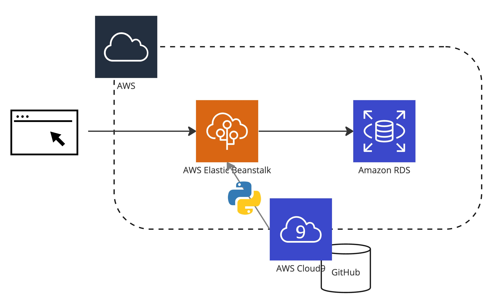
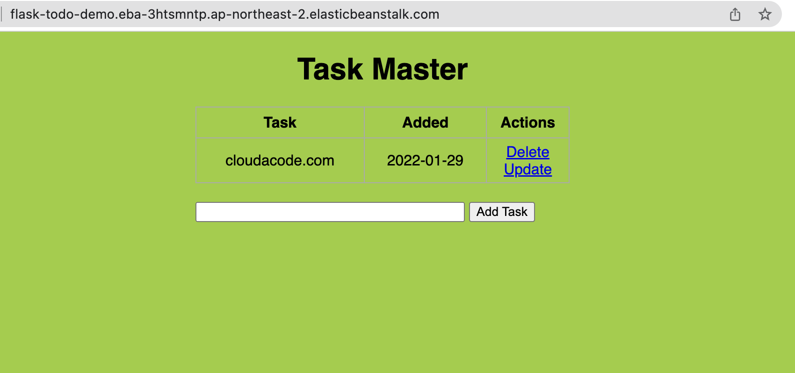
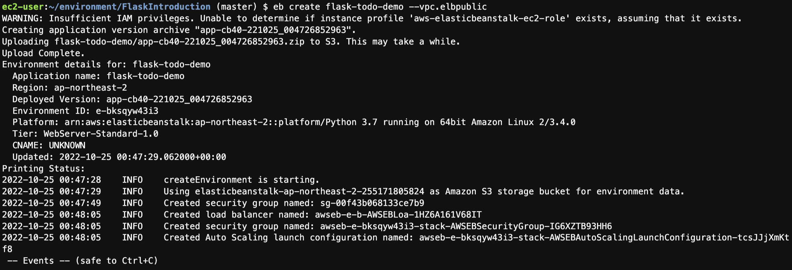
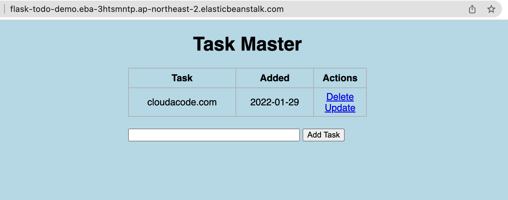

# Deploy a Flask app on Amazon ElasticBeanstalk

**Amazon ElasticBeanstalk로 Python Flask App 배포 실습**

이번 실습은 Amazon Elastic Beanstalk을 통해 웹앱을 구성 해보는 실습입니다. AWS에서 가장 대표적인 PaaS인 ElasticBeanstalk를 운영하는 방법과 코드 배포 방법을 이해할 수 있습니다.



**Time to Complete: 0.5 hours**

<div>
<a id="channel-add-button" target="_blank" href="http://pf.kakao.com/_nxoaTs">
  
</a>
<a class="github-button" href="https://github.com/cloudacode/tutorials" data-icon="octicon-star" data-size="large" data-show-count="true" aria-label="Star cloudacode/tutorials on GitHub">Star</a>
</div>

**Tutorial Prereqs:**

* **An AWS Account and Administrator-level or PowerUser-level access to it**
* **AWS Cloud9**
[생성 가이드](./cloud9-python-docker.md)
* **AWS EB CLI 설치**
[설치 페이지](https://docs.aws.amazon.com/ko_kr/elasticbeanstalk/latest/dg/eb-cli3-install-advanced.html)
```bash
$ pip install awsebcli --upgrade --user
$ eb --version
EB CLI 3.20.3 (Python 3.7.1)
```

## 1. ElasticBeanstalk 구성

[Amazon Elastic Beanstalk](https://ap-northeast-2.console.aws.amazon.com/elasticbeanstalk/home?region=ap-northeast-2#/welcome)

### Sample Code


Flask [sample](https://github.com/cloudacode/FlaskIntroduction)
```bash
$ git clone https://github.com/cloudacode/FlaskIntroduction
$ cd FlaskIntroduction
# 이번 실습에서는 build 자동화를 연동을 하지 않으며 Warning 메시지를 피하기 위해 buildspec 파일 삭제
$ rm -rf buildspec.yml
```

### EB Application 및 environment 배포

```bash
$ eb init -p python-3.7 flask-todo-demo --region ap-northeast-2
Application flask-todo has been created.
```

### EB Environment 배포

```bash
$ eb create flask-todo-demo --vpc.elbpublic
```


만약 특정 VPC에 배포를 하고 싶은 경우는 vpc 옵션을 추가적으로 부여

```bash
$ eb create flask-todo-demo -r ap-northeast-2 --vpc.id <vpc-id> \
--vpc.elbsubnets <subnet-01,subnet-02> --vpc.ec2subnets <subnet-01,subnet-02> \
--vpc.publicip --vpc.elbpublic
```

만약 Database 까지 함께 배포를 하고 싶은 경우는 `-db` 옵션을 추가

!!! WARN
    ElasticBeanstalk를 생성하면서 DB를 함께 생성하는 경우 추후에 EB 삭제시 DB도 함께 삭제가 되므로 RDS는 별도로 생성 해서 연동 하는 것을 추천

### (옵션) EB 환경변수 설정

추후 EB에 환경 변수를 함께 전달 하고 싶은 경우

```bash
$ mkdir -p .ebextensions
$ cat <<'EOF' > .ebextensions/options.config
option_settings:
  - option_name: DB_USER
    value: ebroot
  - option_name: DB_PASSWORD
    value: ebsecret
  - option_name: DB_HOST
    value: eb-rds
  - option_name: DB_NAME
    value: todo
EOF
```

### EB 배포 확인 및 로그

[Elastic Beanstalk 환경 관리 CLI](https://docs.aws.amazon.com/ko_kr/elasticbeanstalk/latest/dg/eb-cli3-getting-started.html#ebcli3-basics-create)

```bash
# 로그 확인
$ eb logs
# EB 상태 확인
$ eb status
Environment details for: flask-todo-demo
  Application name: flask-todo-demo
  Region: ap-northeast-2
  Deployed Version: app-a696-221024_235944023808
  Environment ID: e-mdcmmemta3
  Platform: arn:aws:elasticbeanstalk:ap-northeast-2::platform/Python 3.7 running on 64bit Amazon Linux 2/3.4.0
  Tier: WebServer-Standard-1.0
  CNAME: flask-todo-demo.eba-3htsmntp.ap-northeast-2.elasticbeanstalk.com
  Updated: 2022-10-25 00:04:06.247000+00:00
  Status: Ready
  Health: Green
```

해당 `CNAME`을 브라우저에서 접속하여 정상적으로 접근 되는지 확인


## 2. 애플리케이션 수정 및 EB 재배포

### 코드 수정

FlaskIntroduction/static/css/main.css 에 background-color를 lightblue로 변경

```
body, html {
    margin: 0;
    font-family: sans-serif;
    background-color: lightblue;
}
```

git 에 수정 내역 커밋
```bash
$ git add static/css/main.css
$ git commit -m "change bg to lightblue"
```

### EB 재배포

```bash
$ eb deploy
```



## 3. 환경 삭제

[Elastic Beanstalk Environments 콘솔](https://ap-northeast-2.console.aws.amazon.com/elasticbeanstalk/home?region=ap-northeast-2#/environments)에서 환경 삭제

혹은
```bash
$ eb terminate
```

🎉 Congratulations, you have completed Deploying a Flask Application to Elastic Beanstalk

이 글이 유용하였다면 ⭐ Star를, 💬 1:1 질문이나 기술 관련 문의가 필요하신 분들은 클라우드어코드 카카오톡 채널 추가 부탁드립니다.🤗

<div>
<a id="channel-add-button" target="_blank" href="http://pf.kakao.com/_nxoaTs">
  
</a>
<a class="github-button" href="https://github.com/cloudacode/tutorials" data-icon="octicon-star" data-size="large" data-show-count="true" aria-label="Star cloudacode/tutorials on GitHub">Star</a>
</div>

<script async defer src="https://buttons.github.io/buttons.js"></script>
