# Analysis BigData through Amazon EMR, Apache Spark, Zepplin

**Amazon EMR, Apache Spark, Zepplin으로 빅데이터 분석 하기**

이번 실습은 Amazon EMR, Spark, Zepplin을 통해 1억개가 넘는 비행 노선 정보를 가지고 가장 많이 출항 하고 도착하는 도시와 비행정보 그리고 지연된 이력 등을 시각적으로 표현하는 시스템을 구성 하여 원하는 결과를 도출 하여 본다.

**Time to Complete: 0.5 hours**

<div>
<a id="channel-add-button" target="_blank" href="http://pf.kakao.com/_nxoaTs">
  
</a>
<a class="github-button" href="https://github.com/cloudacode/tutorials" data-icon="octicon-star" data-size="large" data-show-count="true" aria-label="Star cloudacode/tutorials on GitHub">Star</a>
</div>

## Architecture
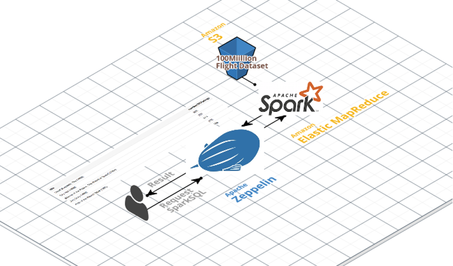

## Objective
- 빅데이터 분석 시스템의 기본적인 구조와 활용 가능 범위를 파악한다.
- 빅데이터 파이프라인(생성, 수집/저장, 분석/가공, 공유/전달)에서 AWS의 활용 요소를 파악한다.
- Zepplin을 통해 Spark 분석엔진을 손쉽게 관리하고 효과적으로 결과를 표현하는 방안을 파악한다.

## Concept
- EMR: 방대한 양의 데이터를 처리 및 분석을 위한 빅데이터 클러스터 플랫폼 이며 Apache Hadoop, Apache Spark을 지원 [What is Amazon EMR?](https://docs.aws.amazon.com/ko_kr/emr/latest/ManagementGuide/emr-what-is-emr.html)
- Spark: Apache Spark는 빅 데이터 워크로드에 주로 사용되는 오픈 소스 분산 처리 시스템. 빠른 성능을 위해 인 메모리 캐싱과 최적화된 실행을 사용하며, 일반 배치 처리, 스트리밍 분석, 기계 학습, 그래프 데이터베이스 및 임시 쿼리를 지원 
- Zepplin: 커멘드라인 형태의 Spark 데이터 분석을 Web적으로 표현하는 어플리케이션


## 1. EMR Cluster 생성(Spark)

### EMR Cluster의 기본적인 스펙과 확장 범위를 설정

[EMR 스펙 페이지](https://aws.amazon.com/emr/pricing/?nc=sn&loc=4)

!!! Info
        실습은 r3.xlarge 스펙(30.5 GiB RAM, 4 vCPUs) **3대**로 진행


[EMR 콘솔](https://ap-northeast-2.console.aws.amazon.com/elasticmapreduce/home?region=ap-northeast-2#) 접근 후 다음과 같이 클러스터 생성

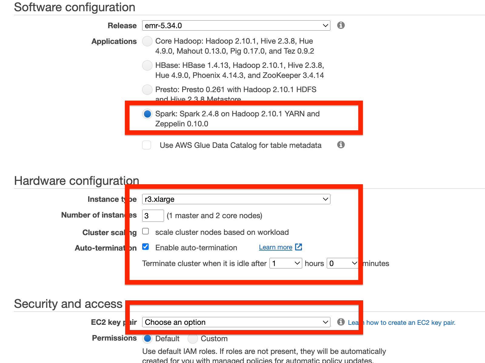

- Cluster Name: 사용할 클러스터 이름
- Software Configuration : 데이터분석 엔진을 선택, 실습에서는 `Spark`
- Hardware Configuration : 데이터분석 엔진 Worker 노드의 사이즈 결정, 비용 절감을 위해 auto-termination 활성화
- Security and Access: EMR 서버에 접속이 필요하지 않으면 key pair에 대해서 Proceed without an EC2 key pair 선택, SSH 접속을 원할 경우 본인의 EC2 key pair 지정

### EMR Cluster의 원격 접근을 위해 Security Group 설정

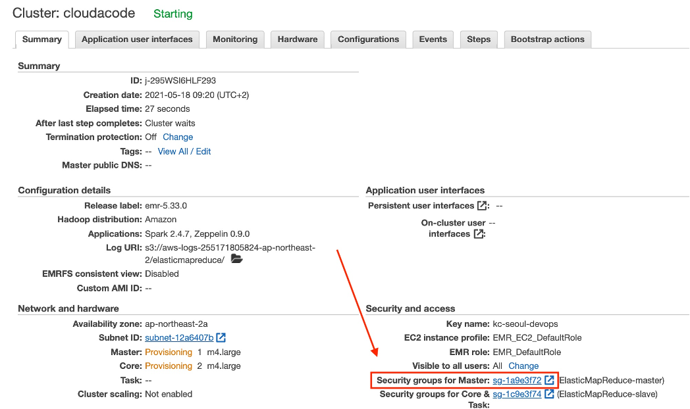

아래와 같이 My IP에 대해 8890, 22 포트를 Add Rule
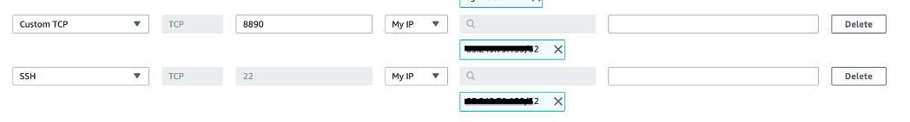

## 2. EMR Cluster 접속

### EMR Cluster에 SSH 접속(Optional)

!!! INFO
        SSH 접속은 클러스터 생성시 Security and Access에서 key pair를 등록한 경우만 가능

지정한 Private key를 통해 Cluster endpoint에 연결
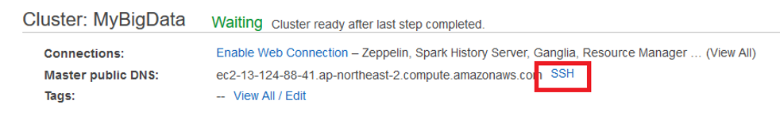

!!! INFO
        username: hadoop

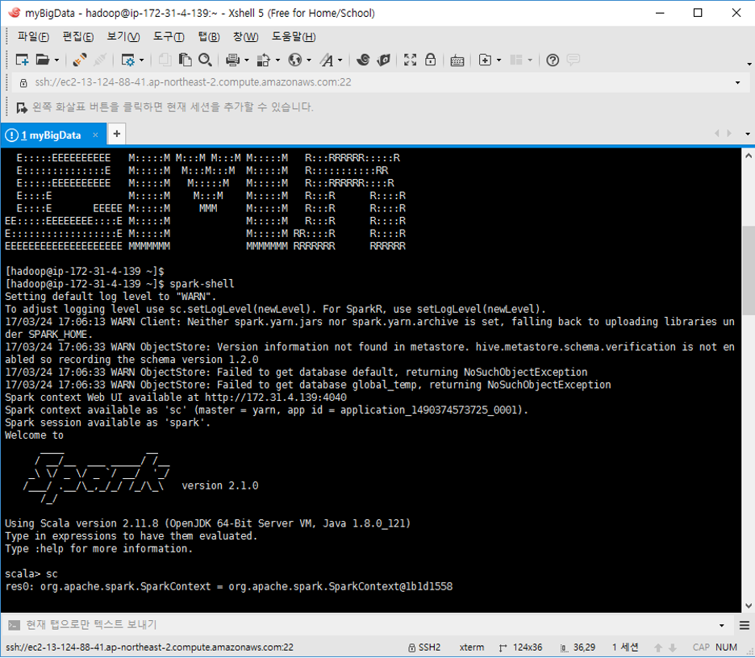

### Zeppelin을 통해 EMR Cluster 연결

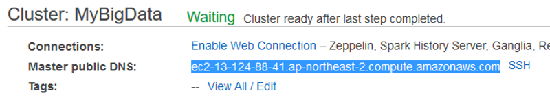

포트는 Master public DNS 엔드포인트에 8890 포트로 접속
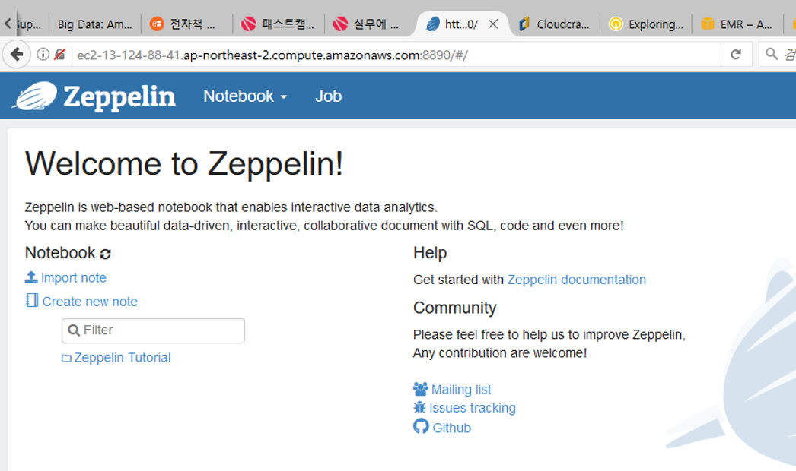

## 3. 데이터 분석 진행

샘플 데이터: 미국 교통 정보 데이터([항공]((https://catalog.data.gov/dataset/airline-on-time-performance-and-causes-of-flight-delays-on-time-data))) 약 80GB
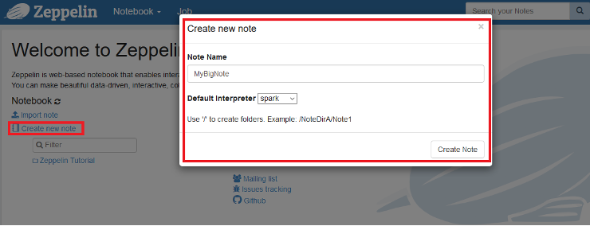

### 비행정보 데이터 적재 및 카운트 수행

```sql
val parquetFile = sqlContext.read.parquet("s3://us-east-1.elasticmapreduce.samples/flightdata/input/")
parquetFile.count()
```

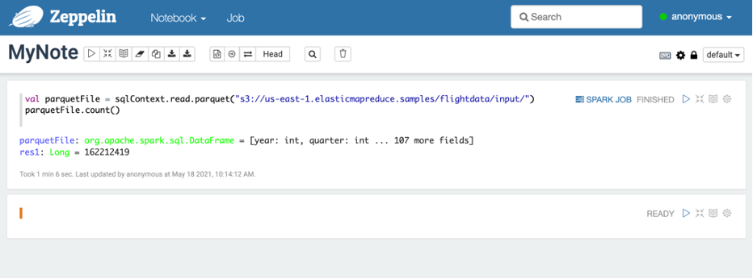

데이터 파일 내용중 3개만 도출
```sql
parquetFile.take(3).foreach(println)
```

데이터를 Flights 테이블에 적재
```sql
parquetFile.registerTempTable("flights")
```

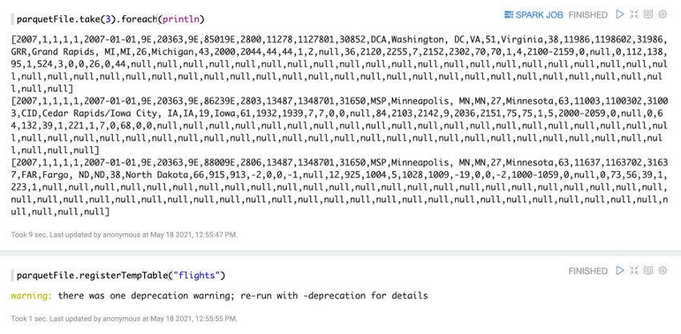

### 분석쿼리 - 2000년도부터 가장 출항을 많이 한 공항

```sql
%sql
SELECT origin, count(*) AS total_departures
FROM flights
WHERE year >= 2000
GROUP BY origin
ORDER BY total_departures
DESC LIMIT 10
```

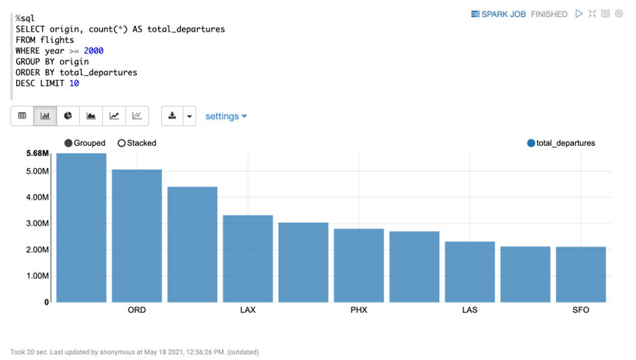

### 분석쿼리 - 출발 지연이 가장 많았던 공항

```sql
%sql
SELECT origin, count(depdelayminutes) AS total_delays
FROM flights
WHERE depdelayminutes > 15 AND year >= 2000
GROUP BY origin
ORDER BY total_delays
DESC LIMIT 10
```

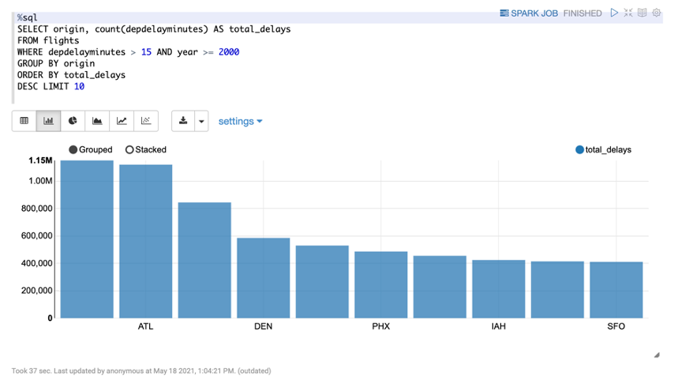

### 분석쿼리 - 가장 출항을 많이 한 노선

```sql
%sql
SELECT origin, dest, count(*) AS total_flights
FROM flights
WHERE year >= 2000
GROUP BY origin, dest
ORDER BY total_flights
DESC LIMIT 10
```

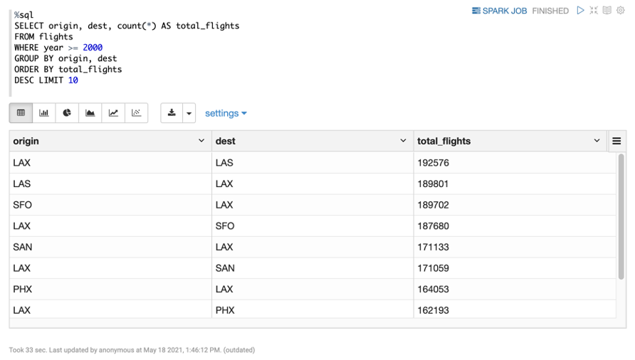

## 4. 환경 삭제

[EMR 콘솔](https://ap-northeast-2.console.aws.amazon.com/elasticmapreduce/home?region=ap-northeast-2#) 접근 후 클러스터 삭제


🎉 Congratulations, you have completed Amazon EMR, Apache Spark, Zepplin tutorial

이 글이 유용하였다면 ⭐ Star를, 💬 1:1 질문이나 기술 관련 문의가 필요하신 분들은 클라우드어코드 카카오톡 채널 추가 부탁드립니다.🤗

<div>
<a id="channel-add-button" target="_blank" href="http://pf.kakao.com/_nxoaTs">
  
</a>
<a class="github-button" href="https://github.com/cloudacode/tutorials" data-icon="octicon-star" data-size="large" data-show-count="true" aria-label="Star cloudacode/tutorials on GitHub">Star</a>
</div>

<script async defer src="https://buttons.github.io/buttons.js"></script>