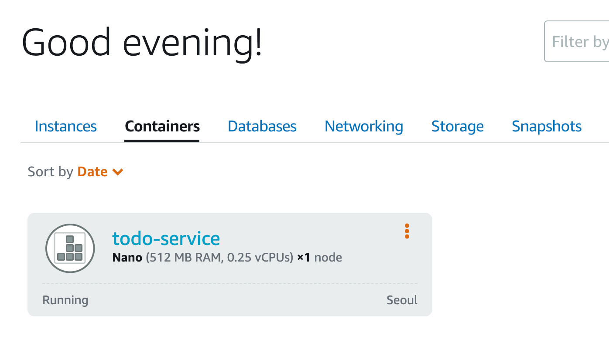
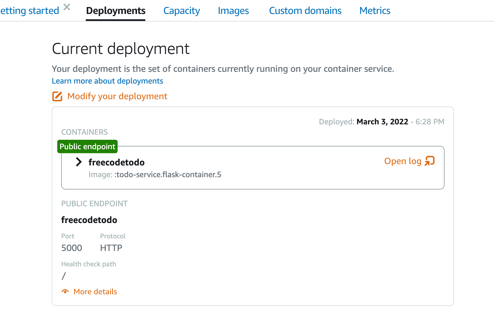
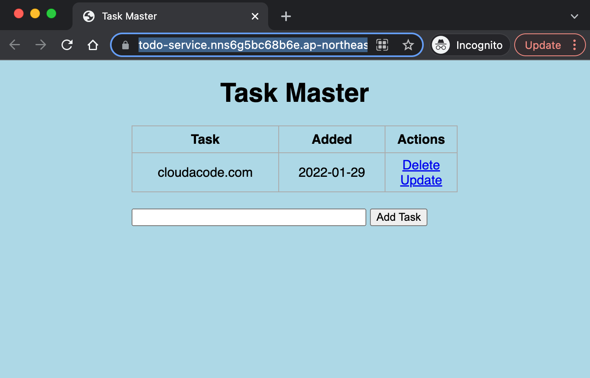

# Deploy Container on AWS Lightsail

**AWS LightSail에 Container 배포**

이번 실습은 AWS LightSail 통해 Container를 배포하고 접근을 해보는 실습 입니다. AWS에서 컨테이너를 배포할수 있는 리소스중 하나인 LightSail에 대해 배워 보고 컨테이너 서비스 배포를 위한 기본 작업들을 이해 할 수 있습니다.

**Time to Complete: 0.5 hours**

<div>
<a id="channel-add-button" target="_blank" href="http://pf.kakao.com/_nxoaTs">
  
</a>
<a class="github-button" href="https://github.com/cloudacode/tutorials" data-icon="octicon-star" data-size="large" data-show-count="true" aria-label="Star cloudacode/tutorials on GitHub">Star</a>
</div>

**Tutorial Prereqs:**

* **An AWS Account and Administrator-level or PowerUser-level access to it**
* **본인이 생성한 컨테이너 이미지** [freecode-todo](https://hub.docker.com/repository/docker/cloudacode/freecodetodo)
* **AWS CLI 및 Lightsail Plugin설치**
[설치 페이지](https://lightsail.aws.amazon.com/ls/docs/en_us/articles/amazon-lightsail-install-software#install-software-aws-cli)

!!! Warning
    Cloud9은 CLI 버전이 1이고 IAM 권한이 제한 되기 때문에 local 개발 환경에서 실습 진행


## 1. Create a Container server on lightsail

### Lightsail의 기본적인 스펙과 확장 범위를 설정

[Lightsail 스펙 페이지](https://aws.amazon.com/lightsail/pricing/?nc1=h_ls)

!!! Info
        실습은 nano 스펙(512 MB RAM, 0.25 vCPUs)으로 진행

```bash
aws lightsail create-container-service \
--service-name <YOUR_SERVICE_NAME> --power nano --scale 1
```

[Lightsail AWS 콘솔](https://lightsail.aws.amazon.com/ls/webapp/home/containers) 에서 확인 가능


### Continaer 이미지 다운

```bash
docker pull cloudacode/freecodetodo:latest
```

참고: `cloudacode/freecodetodo` [소스 코드](https://github.com/cloudacode/FlaskIntroduction)

### Container 이미지 업로드

```bash
aws lightsail push-container-image --service-name <YOUR_SERVICE_NAME> \
 --label flask-container --image cloudacode/freecodetodo:latest
```

!!! Warning
        output 결과로 나오는 ":devops-flask-service.flask-container.[숫자]"가 배포시 사용할 컨테이너 이미지의 정보이므로 결과 값을 저장

## 2. Deploy the container

### 컨테이너 메타데이터 파일 생성

containers.json
```json
{
    "<container-image-name>": {
        "image": ":<service-name>.<label>.X",
        "ports": {
            "<container-port>": "HTTP"
        }
    }
}
```

예시)
```json
{
    "freecodetodo": {
        "image": ":todo-service.flask-container.5",
        "ports": {
            "5000": "HTTP"
        }
    }
}
```

!!! Note
        본인의 서비스의 ports 맞게 변경 필요, ex) nodejs 기본포트는 3000, flask는 5000

### 컨테이너의 Endpoint 설정 파일 생성

public-endpoint.json
```json
{
    "containerName": "<container image name>",
    "containerPort": <container port>
}
```

예시)
```json
{
    "containerName": "freecodetodo",
    "containerPort": 5000
}
```

!!! Note
        본인의 서비스의 포트에 맞게 변경 필요


### 서비스 배포 수행

```bash
aws lightsail create-container-service-deployment --service-name <YOUR_SERVICE_NAME> \
--containers file://containers.json --public-endpoint file://public-endpoint.json
```

## 3. 서비스 확인

[Lightsail 콘솔](https://lightsail.aws.amazon.com/ls/webapp/home/containers) 혹은 aws lightsail cli로 확인

```bash
aws lightsail get-container-services --service-name <YOUR_SERVICE_NAME>
```
을 수행하여 `STATE`가 `RUNNING` 으로 상태가 변경 되었으면 `URL`로 서비스 접속



해당 `URL`을 브라우저에서 접속하여 컨테이너가 정상적으로 서비스 중인지 확인



## 4. 환경 삭제

[Lightsail 콘솔](https://lightsail.aws.amazon.com/ls/webapp/home/containers) 혹은 aws lightsail cli 로 삭제

```bash
aws lightsail delete-container-service --service-name todo-service
```

🎉 Congratulations, you have completed AWS lightsail tutorial

이 글이 유용하였다면 ⭐ Star를, 💬 1:1 질문이나 기술 관련 문의가 필요하신 분들은 클라우드어코드 카카오톡 채널 추가 부탁드립니다.🤗

<div>
<a id="channel-add-button" target="_blank" href="http://pf.kakao.com/_nxoaTs">
  
</a>
<a class="github-button" href="https://github.com/cloudacode/tutorials" data-icon="octicon-star" data-size="large" data-show-count="true" aria-label="Star cloudacode/tutorials on GitHub">Star</a>
</div>

<script async defer src="https://buttons.github.io/buttons.js"></script>
