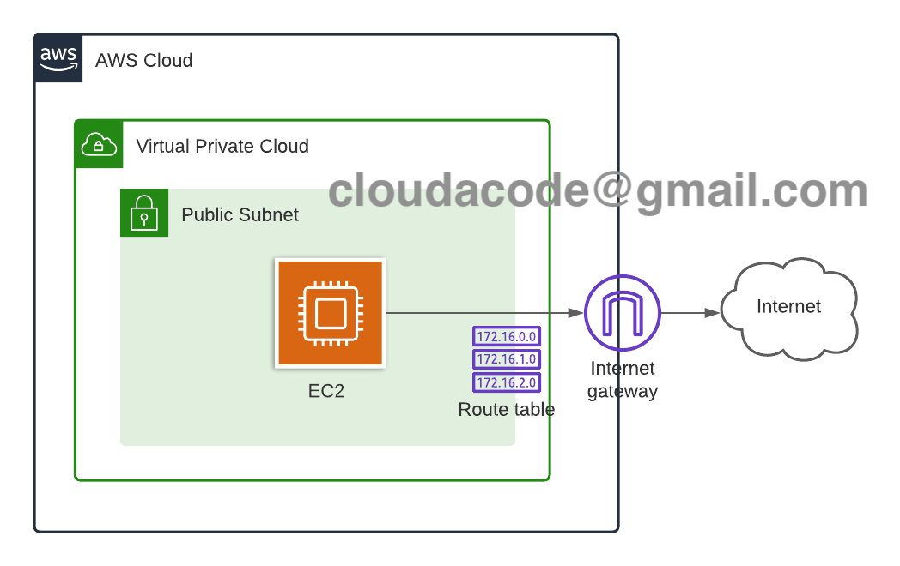
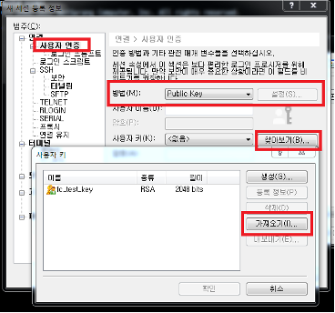
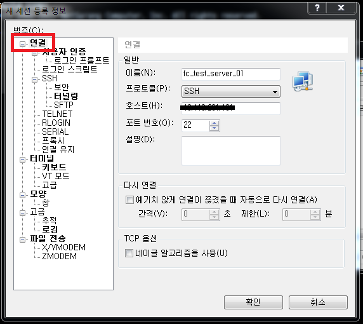

# Launch an EC2, Deploy Flask app

**AWS EC2 구성 및 Python Flask 앱 배포**

이번 실습은 AWS를 통해 서비스 구성 시 가장 기본이 되는 EC2 구성 실습을 통해서 AWS의 기본 서비스들을 이해 하고 AWS 콘솔 활용 방법을 익히기 위함입니다. EC2로 컴퓨팅 리소스 활용 및 서비스 배포를 위한 기본 작업들을 이해 할 수 있습니다.

**Time to Complete: 1-2 hours**

**Tutorial Prereqs:**

* **An AWS Account and Administrator-level or PowerUser-level access to it**

## System Architecture


## 1. Launch EC2 instance

https://ap-northeast-2.console.aws.amazon.com/ec2/v2/home?region=ap-northeast-2

### Choose an Amazon Machine Image(AMI)

Instance 의 OS 이미지를 선택하는 단계 이며 Amazon Linux, CentOS, Ubunt, WindowsOS 등 다양한 OS 이미지를 선택 가능

`Amazon Linux 2 AMI (HVM), SSD Volume Type`

### Chooose an Instance Type

Instance의 CPU, Memory , Network 용량을 선택 하는 단계이며 일반 인스턴트 타입외에 높은 CPU, Memory, IO 타입도 제공

`t2.micro`

### Instance Details 

Instance가 배포되는 네트워크 환경 VPC, Subnet) 설정

- Number of instances: 한번에 배포할 인스턴스의 개수이며 1로 유지
- Purchasing option: Spot instances를 활용 할건지의 유무, 선택 하지 않음
- Network: Default VPC 선택
- Subnet: No preference
- Auto-assign Public IP: 자동으로 Public IP 할당 유무를 체크 하는 부분 Enable로 선택
- IAM role: EC2 인스턴스에 IAM 역할을 부여해 추후 API/ Secret key를 사용하지 않고 AWS 소스 자원을 관리 하도록 설정 하는 부분
- Tenancy: 추후에 License이슈 혹은 매우 낮은 네트워크 Latency를 위해 특정 Hardware에 Instance를 몰아서 배치할 수 있는 기능, Default(Shared)로 선택

### Instance Storage 설정

Instance의 Disk 용량과 추가 Disk를 선택, Root 볼륨 size와 Disk 볼륨의 유무, size를 정하는 부분

기본 `8GB`로 진행

### Add Tags

AWS콘솔에서 Display 되는 Tag 의 값을 지정 하는 부분 이고 Add Tag 텝 클릭 후 값 입력
(*추후 손쉽게 생성한 서버를 찾기 위함이며 기억할 수 있는 이름으로 서버 이름 변경 가능

`Key: Name, Value: Web Server`

### Configure Security Group

SG는 Host 레벨의 방화벽이며 Allow 정책만 가능하며 서비스할 Port 만 허용 혹은 원격 접속을 위한 접근 대역 IP 로만 제한을 통해 보안 수준을 높임

Secuirty Group Name: `test-flask-sg`

- SSH(22)
    - Type: SSH
    - Source: My IP or Anywhere
- TCP(5000, Flask)
    - Type: Custom TCP
    - PORT: 5000
    - Source: My IP or Anywhere

!!! Note
    만약 node.js 혹은 django 로 실습을 수행할 시에 해당 포트에 맞게 Custom TCP port 설정 변경

### Review Instance Launch

Instance 배포를 위해 지정한 설정값들을 리뷰 하는 단계 이며 서버에 접근을 위한 key 발급을 진행, Launch 클릭후 key pair 생성

**Create a new key pair** 진행 후 Download Key Pair

!!! Warning 
    key는 재발급 되지 않으므로 안전한 곳에 key 를 저장 

## 2. Monitor EC2 instance

정상적으로 Instance가 배포 되는지 EC2 Dashboard에서 확인 가능
Status Checks 가 2/2가 되면 정상 배포 완료

## 3. Access EC2 instance

[EC2 콘솔](https://ap-northeast-2.console.aws.amazon.com/ec2/v2/home?region=ap-northeast-2#Instances:instanceState=running)에서 생성한 인스턴스 선택 후 **connect** 버튼을 클릭하면 터미널로 접속 가이드라인이 아래와 같이 제공

```bash
 ssh -i <your_key> ec2-user@<EC2_HOSTNAME>
```

만약 Windows를 사용 하고 있다면 Xshell을 활용

공식 홈페이지에서 다운로드
URL:
https://www.netsarang.co.kr/download/main.html

항목: Xshell5
https://www.netsarang.co.kr/download/down_form.html?code=512

- 새로운 세션 생성 및 사용자 인증
  




## 4. Run Python Flask on EC2 server

접근한 Linux에서 Flask 설치
```bash
pip3 install Flask
pip3 freeze > requirements.txt
```

Flask app 파일 설정 `app.py`
```bash
cat <<EOF > app.py
from flask import Flask
app = Flask(__name__)

@app.route('/')
def hello_world():
    return "Hello, EC2!"

if __name__ == "__main__":
        app.run(debug=True, host='0.0.0.0', port=5000)
EOF
```

Flask app 실행
```bash
python3 app.py
```

[EC2 콘솔](https://ap-northeast-2.console.aws.amazon.com/ec2/v2/home?region=ap-northeast-2#Instances:instanceState=running) 
에서 **Public IPv4 address** 확인 혹은 리눅스 커멘드로 `curl ifconfig.me` 후 해당 IP에 Flask 포트(5000) 으로 접속 및 페이지 확인

(옵션) Flask에 CSS, HTML 페이지를 구성 하고 싶을 경우 아래 코드를 참고

[simple-flask-web-app](https://github.com/cloudacode/coolstuff/tree/main/simple-flask-web)

🎉 Congratulations, you have completed EC2, Flask setup tutorial 