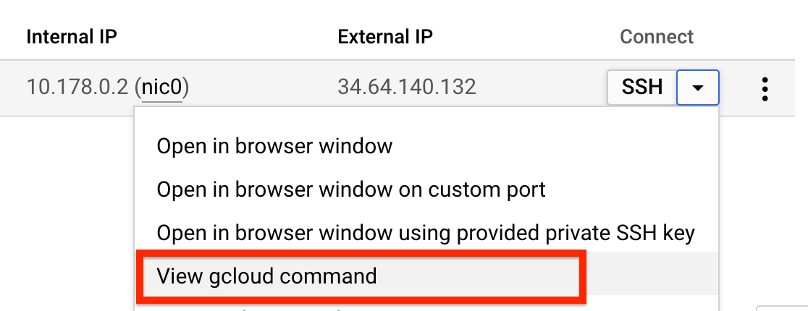

# GCP - Compute Engine 구축

**GCP 환경 구성 및 Compute Engine 구축**

이번 실습은 GCP를 통해 서비스 구성 시 가장 기본이 되는 Compute Engine 구성 실습을 통해서 GCP의 기본 서비스들을 이해 하고 GCP 콘솔 활용 방법을 익히기 위함입니다. Compute Engine 컴퓨팅 리소스 활용 및 서비스 배포를 위한 기본 작업들을 이해 할 수 있습니다.

**Time to Complete: 1-2 hours**

**Tutorial Prereqs:**

* **GCP Account and Administrator-level or PowerUser-level access to it**

## System Architecture

## 1. Launch GCE instance

https://console.cloud.google.com/compute

### Create VM instances

- Name: `gcp-test`
- Region: `asia-northeast3(Seoul)` Zone: `asia-northeast3-a`
- Machine configuration: 인스턴스의 크기(타입)
- Confidential VM service: 데이터 암호화 옵션(`변경 없음`)
- Container: GKE 혹은 GCE에 컨테이너를 활용 옵션(`변경 없음`)
- Boot Disk: OS 이미지(`Debian`)
- Identity and API access
  - Service account: 인스턴스, 인스턴스에서 실행되는 앱이 다른 GCP 서비스와 상호작용 할때 필요한 서비스 계정(`변경 없음`)
  - Access scopes: 접근 범위(`Allow default access`)
- Firewall: 방화벽
  - Allow HTTP traffic (`체크`)

## 2. Access a GCE instance

VM Instance 콘솔 화면 Connect 항목에 `SSH` 클릭 후 `View gcloud command` 를 통해 인스턴스 접근


gcloud command line 창에서 오른쪽 아래 `RUN IN CLOUD SHELL` 클릭

Cloud Shell이 열리고 인스턴스 접근에 대한 커멘드 라인이 자동으로 입력되어 있으므로 추가 변경 없이 진행 하면 정상적으로 인스턴스에 접근이 됨
* SSH Key 생성이 이루어지고 추가 입력값 없이 빈칸으로 진행


## 3. Install httpd on Linux

접근한 Linux에서 Nginx 설치
```bash
sudo apt-get update
sudo apt-get install nginx -y
```

브라우져에서 GCE `http://EXTERNAL_IP/` 접속 및 페이지 확인