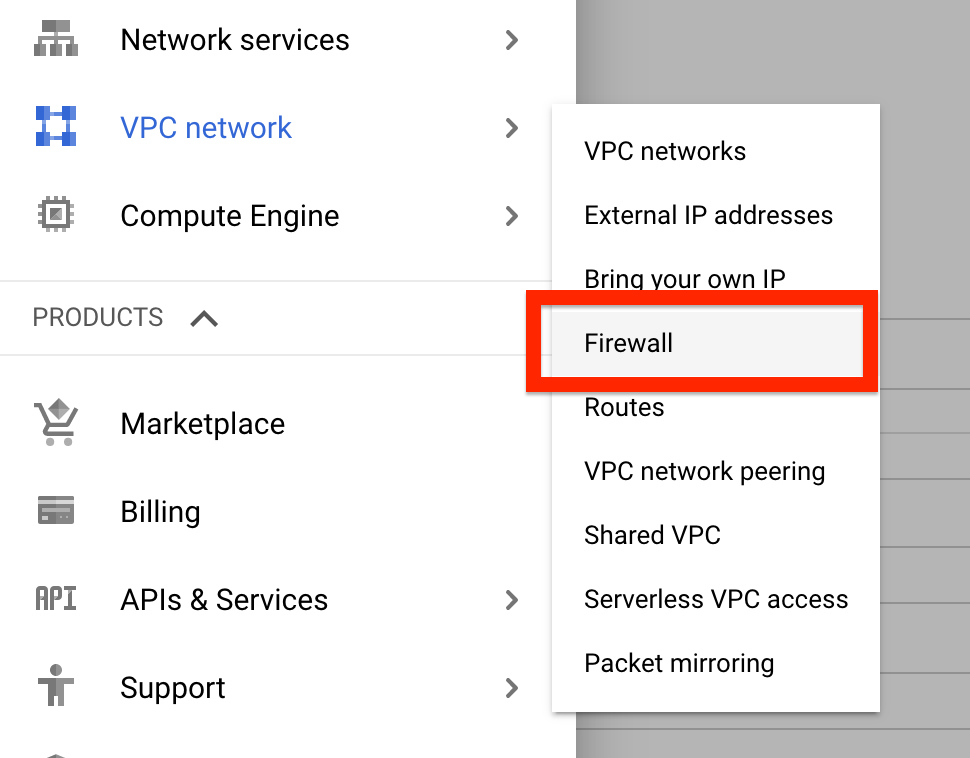

# Launch a GCE, Deploy Flask app

**GCP 환경 구성 및 Compute Engine 구축**

이번 실습은 GCP를 통해 서비스 구성 시 가장 기본이 되는 Compute Engine 구성 실습을 통해서 GCP의 기본 서비스들을 이해 하고 GCP 콘솔 활용 방법을 익히기 위함입니다. Compute Engine 컴퓨팅 리소스 활용 및 서비스 배포를 위한 기본 작업들을 이해 할 수 있습니다.

**Time to Complete: 1-2 hours**

**Tutorial Prereqs:**

* **GCP Account and Administrator-level or PowerUser-level access to it**

## System Architecture

## 1. Launch GCE instance

https://console.cloud.google.com/compute

### Create VM instances

- Name: `gcp-test`
- Region: `asia-northeast3(Seoul)` Zone: `asia-northeast3-a`
- Machine configuration: 인스턴스의 크기(타입)
- Confidential VM service: 데이터 암호화 옵션(`변경 없음`)
- Container: GKE 혹은 GCE에 컨테이너를 활용 옵션(`변경 없음`)
- Boot Disk: OS 이미지(`Debian`)
- Identity and API access
  - Service account: 인스턴스, 인스턴스에서 실행되는 앱이 다른 GCP 서비스와 상호작용 할때 필요한 서비스 계정(`변경 없음`)
  - Access scopes: 접근 범위(`Allow default access`)
- Firewall: 방화벽
  - Allow HTTP traffic (`변경 없음`)

### Create a firewall

Flask 서비스 포트(5000)을 custom하게 firewall에 추가가 필요


로 접속 하여 **Create Firewall Rule** 선택 후 아래와 같이 입력

- Name: default-flask-app
- Network: default
- Prioity: 1000
- Direction of traffic: ingress
- Action on match: Allow
- Targets: All instances in the network
- Source filter: IP ranges
- Source IP Ranges: `0.0.0.0/0`
- Protocol and ports:
    - Specified protocols and ports: `tcp` `5000`

!!! Note
    만약 node.js 혹은 django 로 실습을 수행할 시에 해당 포트에 맞게 Custom TCP port 설정 변경

## 2. Access a GCE instance

VM Instance 콘솔 화면 Connect 항목에 `SSH` 클릭 후 `View gcloud command` 를 통해 인스턴스 접근


gcloud command line 창에서 오른쪽 아래 `RUN IN CLOUD SHELL` 클릭

Cloud Shell이 열리고 인스턴스 접근에 대한 커멘드 라인이 자동으로 입력되어 있으므로 추가 변경 없이 진행 하면 정상적으로 인스턴스에 접근이 됨
* SSH Key 생성이 이루어지고 추가 입력값 없이 빈칸으로 진행


## 3. Run Python Flask on GCE server

GCE 리눅스 서버에 접속 후 python3-pip 패키지 설치
```bash
sudo apt update
sudo apt install python3-pip
```

접근한 Linux에서 Flask 설치
```bash
pip3 install Flask
pip3 freeze > requirements.txt
```

Flask app 파일 설정 `app.py`
```bash
cat <<EOF > app.py
from flask import Flask
app = Flask(__name__)

@app.route('/')
def hello_world():
    return "Hello, GCE!"

if __name__ == "__main__":
        app.run(debug=True, host='0.0.0.0', port=5000)
EOF
```

Flask app 실행
```bash
python3 app.py
```

GCE의 External IP를 확인 후 해당 IP에 Flask Port(5000)으로 접속 및 페이지 확인

(옵션) Flask에 CSS, HTML 페이지를 구성 하고 싶을 경우 아래 코드를 참고

[simple-flask-web-app](https://github.com/cloudacode/coolstuff/tree/main/simple-flask-web)

🎉 Congratulations, you have completed GCE, Flask setup tutorial 