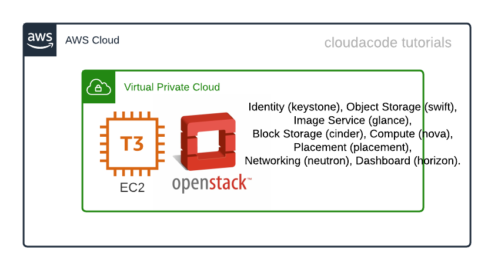
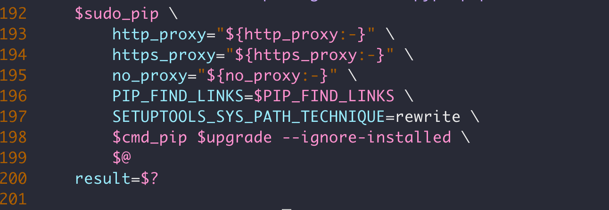
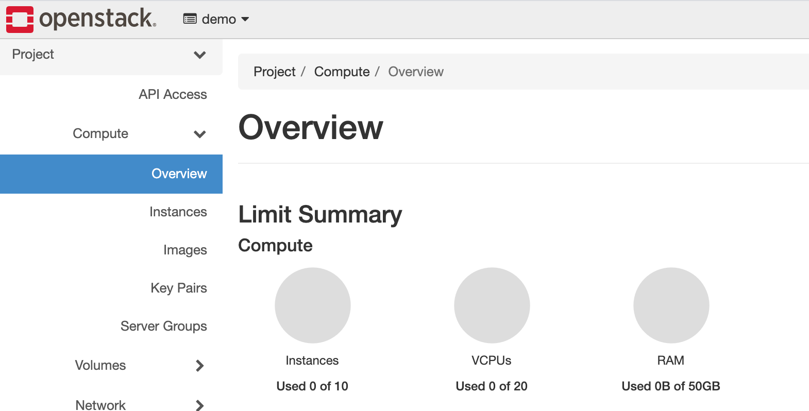

# Deploy openstack(devstack) on EC2

**EC2 인스턴스에 테스트용 Openstack 설치**

이번 실습은 DevStack(테스트용 Openstack)을 EC2에 설치하고 Horizon 대시보드를 통해 Openstack의 기본 리소스(컴퓨팅, 스토리지, 네트워크 등)를 배포하고 이해 할 수 있습니다.

**Time to Complete: 1-2 hours**

**Tutorial Prereqs:**

* **An AWS Account and PowerUser-level access to it**
* **Ubuntu 20.04, t3.xlarge, Spot, 50GB [EC2 Instance](../cloud/aws/../../aws/ec2-setup.md#1-launch-ec2-instance)**

## System Architecture


## 1. Create stack user

```bash
sudo useradd -s /bin/bash -d /opt/stack -m stack
echo "stack ALL=(ALL) NOPASSWD: ALL" | sudo tee /etc/sudoers.d/stack
sudo -u stack -i
```

## 2. Download Devstack

```bash
sudo apt update
sudo apt install git -y
git clone https://opendev.org/openstack/devstack
cd devstack/
```

## 3. Install Devstack

### Update config file
DevStack의 Password 파일 설정 `local.conf`
```bash
cat <<EOF > local.conf
[[local|localrc]]
ADMIN_PASSWORD=cloudacode
DATABASE_PASSWORD=cloudacode
RABBIT_PASSWORD=cloudacode
SERVICE_PASSWORD=cloudacode
EOF
```

설치과정 중 python pip module upgrade시에 발생하는 경고 메시지를 무시하기 위해 `inc/python` 파일 일부를 수정, 198번째 라인에 아래 옵션 추가
```bash
--ignore-installed
```


### Install devstack
using `stack.sh` to install devstack. 
```bash
./stack.sh
```

!!! Warning
    will take a 15-20 minutes to install a lot of dependencies

정상적으로 완료가 되면 다음과 같은 메시지를 확인 할 수 있다.

```bash
=================
 Async summary
=================
 Time spent in the background minus waits: 342 sec
 Elapsed time: 1369 sec
 Time if we did everything serially: 1711 sec
 Speedup:  1.24982

This is your host IP address: 172.31.2.38
This is your host IPv6 address: ::1
Horizon is now available at http://172.31.2.38/dashboard
Keystone is serving at http://172.31.2.38/identity/
The default users are: admin and demo
The password: cloudacode

Services are running under systemd unit files.
For more information see:
https://docs.openstack.org/devstack/latest/systemd.html

DevStack Version: xena
OS Version: Ubuntu 20.04 focal
```

## 4. Access Openstack dashboard 

[EC2 콘솔](https://ap-northeast-2.console.aws.amazon.com/ec2/v2/home?region=ap-northeast-2#Instances:instanceState=running) 
에서 **Public IPv4 address** 확인 혹은 리눅스 커멘드로 `curl ifconfig.me` 후 해당 IP에 HTTP로 접속 및 페이지 확인

!!! Note
    ID: admin, PW: cloudacode



## 5. Create an instance

<iframe width="560" height="315" src="https://www.youtube.com/embed/7mbeZndZ4ZU" title="YouTube video player" frameborder="0" allow="accelerometer; autoplay; clipboard-write; encrypted-media; gyroscope; picture-in-picture" allowfullscreen></iframe>


🎉 Congratulations, you have completed Openstack tutorial 