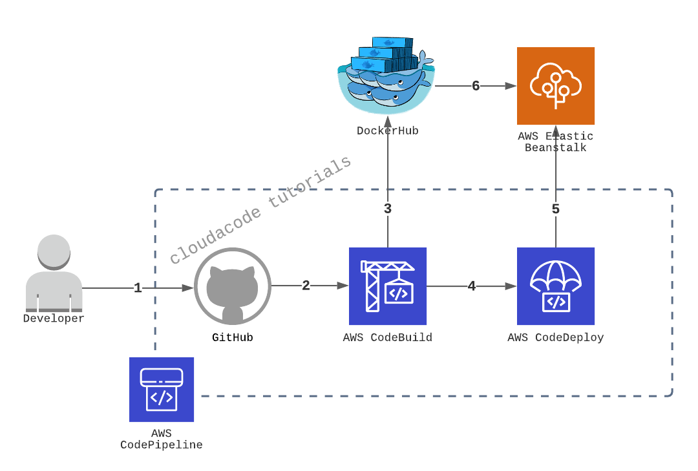

# Continuous delivery - AWS CodePipeline

**개발 빌드 및 배포 환경 자동화 실습**

CI/CD Pipeline 도구를 통해 소스 관리, 도커 빌드 자동화, 서비스 배포 까지 자동화

**Time to Complete: 2-3 hours**

**Tutorial Prereqs:**

[CI Integration](./github-aws-codebuild-dockerhub.md)

* **An AWS Account and Administrator-level or PowerUser-level access to it**

## System Architecture


<div>
<a id="channel-add-button" target="_blank" href="http://pf.kakao.com/_nxoaTs">
  
</a>
<a class="github-button" href="https://github.com/cloudacode/tutorials" data-icon="octicon-star" data-size="large" data-show-count="true" aria-label="Star cloudacode/tutorials on GitHub">Star</a>
</div>

## 1. Setup ElasticBeanstalk

[ElasticBeanstalk Console](https://ap-northeast-2.console.aws.amazon.com/elasticbeanstalk/home?region=ap-northeast-2#/welcome)

### Create Application(Create a Web app)

1. Application Name
2. Platform: Docker, Platform Branch: Docker running...Amazon Linux 2, Platform version: Recommended
3. Application Code: Sample application

EB(ElasticBeanstalk) app 생성 확인까지 약 5분 소요

## 2. Update the Buildspec file for EB

CodePipline의 명세서 buildspec.yml 을 작성

[앞 실습](./github-aws-codebuild-dockerhub.md)에서 만들었던 Buidspec 파일에 Elastic Beanstalk에서 실행할 docker image 정보를 artifact로 넘겨주기 위한 설정을 추가

```yaml
      - echo Writing image definitions file...
      - printf '{"AWSEBDockerrunVersion":"1","Image":{"Name":"%s"},"Ports":[{"ContainerPort":"5000"}]}' $IMAGE_REPO_NAME:$TAG > Dockerrun.aws.json
artifacts:
    files: Dockerrun.aws.json
``` 

예시)
```bash
version: 0.2

phases:
  pre_build:
    commands:
      - echo Logging in to Docker Hub...
      - docker login -u $DOCKERHUB_USER -p $DOCKERHUB_PW
      - TAG="$(echo $CODEBUILD_RESOLVED_SOURCE_VERSION | head -c 8)"
  build:
    commands:
      - echo Build started on `date`
      - echo Building the Docker image...
      - docker build -t $IMAGE_REPO_NAME:$TAG .
      - docker tag $IMAGE_REPO_NAME:$TAG $IMAGE_REPO_NAME:$TAG
  post_build:
    commands:
      - echo Build completed on `date`
      - echo Pushing the Docker image...
      - docker push $IMAGE_REPO_NAME:$TAG
      - echo Writing image definitions file...
      - printf '{"AWSEBDockerrunVersion":"1","Image":{"Name":"%s"},"Ports":[{"ContainerPort":"5000"}]}' $IMAGE_REPO_NAME:$TAG > Dockerrun.aws.json
artifacts:
    files: Dockerrun.aws.json
```

!!! note
      만약 본인이 작성한 application의 port가 `8000`이 아니라면 본인 포트에 맞게 변경 필요!
      e.g., `{"ContainerPort":"3000"}`

## 3. Setup codepipeline

[CodePipeline console](https://ap-northeast-2.console.aws.amazon.com/codesuite/codepipeline/pipelines)

### Step 1: Pipeline settings
1. Pipeline Name
2. Service Role: New Service Role
3. Role Name: `AWSCodePipelineServiceRole-ap-northeast-2-[Pipeline Name]`
   - AWS CodePipeline이 이 새 파이프라인에 사용할 서비스 역할을 생성하도록 허용 활성화
  
### Step 2: Source Stage
1. 소스: Github(Version 1), 내 GitHub 계정의 리포지토리
   - Github v2가 권고 사항이나 실습은 v1로 진행: [v2 변경시 참고](https://docs.aws.amazon.com/ko_kr/codepipeline/latest/userguide/update-github-action-connections.html)
2. Repository, Branch: 본인의 Repo, 원하는 Branch name e.g., main, dev, release
3. Detection option: GitHub Webhook(recommended)

### Step 3: Build Stage

[앞 실습](./github-aws-codebuild-dockerhub.md)
에서 설정한 codebuild 프로젝트 활용, 만약 새로운 codebuild project를 생성할 경우 앞 실습 가이드라인에 따라서 프로젝트 생성

### Step 4: Deploy Stage
1. Provider: AWS Elastic Beanstalk
2. Application Name, Environment Name: 위에서 자동 생성한 [EB 정보](#create-applicationcreate-a-web-app)

## 4. Verify CodePipeline

### 테스트 Pull Request/Merge 

별도의 Branch를 만들어 flask-app의 코드 변경(예, style.css 배경 변경) 후 main branch로 PR 수행.

https://ap-northeast-2.console.aws.amazon.com/codesuite/codepipeline/pipelines

Pipeline 도구가 변경 사항을 인지하여 자동으로 빌드/배포가 수행 되는지 확인

### ElasticBeanstalk 환경 URL 확인 

EB의 애플리케이션 [환경 URL](#create-applicationcreate-a-web-app) 확인 후 정상적으로 웹페이지에 변경이 일어났는지 확인

🎉 Congratulations, you have completed Continuous delivery - AWS CodePipeline tutorial

이 글이 유용하였다면 ⭐ Star를, 💬 1:1 질문이나 기술 관련 문의가 필요하신 분들은 클라우드어코드 카카오톡 채널 추가 부탁드립니다.🤗

<div>
<a id="channel-add-button" target="_blank" href="http://pf.kakao.com/_nxoaTs">
  
</a>
<a class="github-button" href="https://github.com/cloudacode/tutorials" data-icon="octicon-star" data-size="large" data-show-count="true" aria-label="Star cloudacode/tutorials on GitHub">Star</a>
</div>

<script async defer src="https://buttons.github.io/buttons.js"></script>

## 참고 자료

- https://docs.aws.amazon.com/elasticbeanstalk/latest/dg/single-container-docker-configuration.html#docker-configuration.no-compose
- https://d1.awsstatic.com/whitepapers/DevOps/practicing-continuous-integration-continuous-delivery-on-AWS.pdf
- https://docs.aws.amazon.com/codebuild/latest/userguide/sample-elastic-beanstalk.html#sample-elastic-beanstalk-codepipeline
- https://docs.aws.amazon.com/ko_kr/codepipeline/latest/userguide/tutorials-four-stage-pipeline.html#tutorials-four-stage-pipeline-prerequisites-jenkins-configure