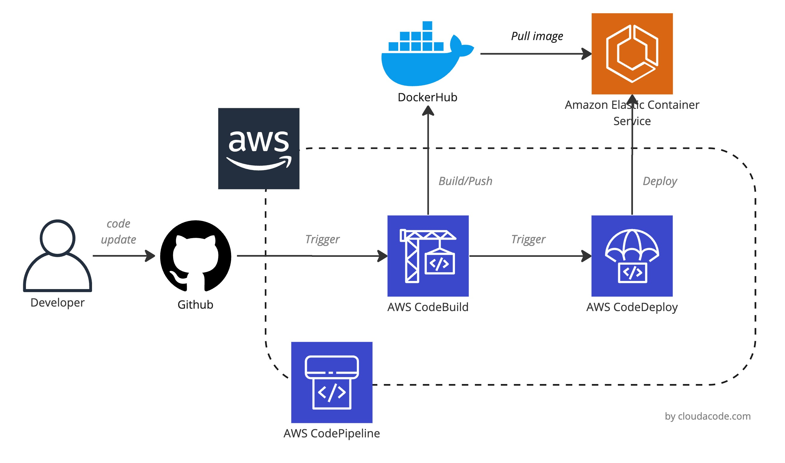
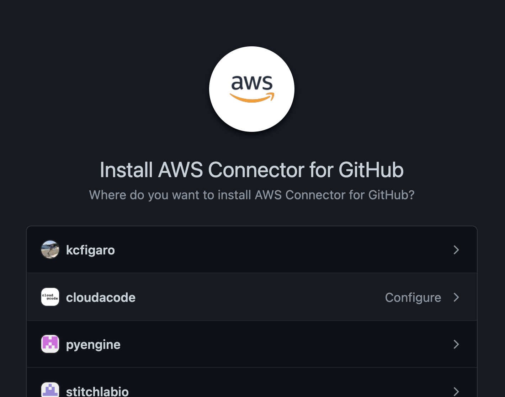
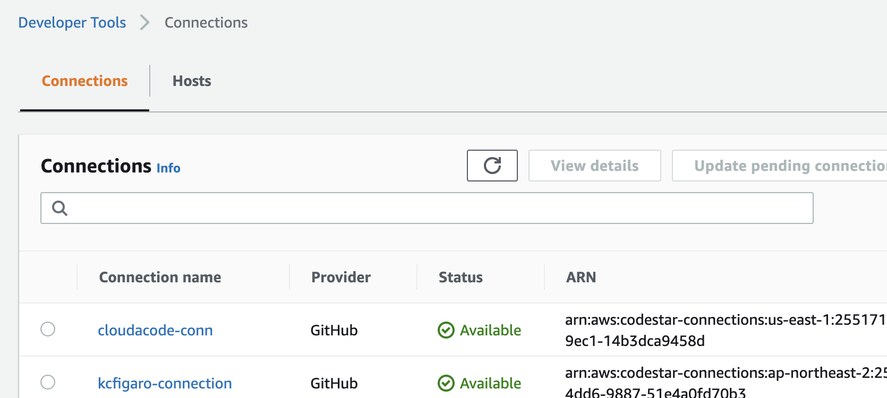
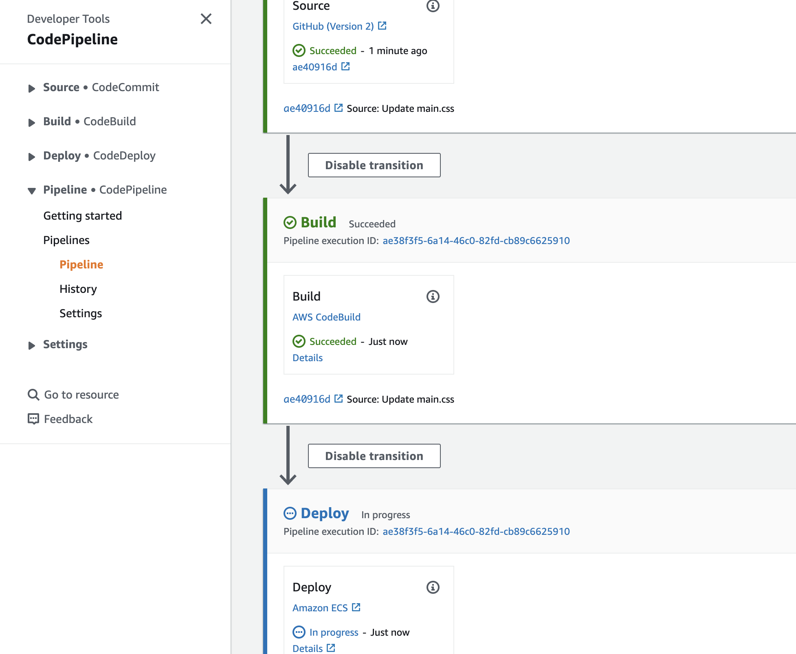

# Continuous delivery - AWS CodePipeline - ECS

**개발 빌드 및 배포 환경 자동화 실습**

CI/CD Pipeline 도구를 통해 소스 관리, 도커 빌드 자동화, 서비스 배포 까지 자동화

**Time to Complete: 2-3 hours**

**Tutorial Prereqs:**

[CI Integration](./github-aws-codebuild-dockerhub.md)

* **An AWS Account and Administrator-level or PowerUser-level access to it**

## System Architecture


<div>
<a id="channel-add-button" target="_blank" href="http://pf.kakao.com/_nxoaTs">
  
</a>
<a class="github-button" href="https://github.com/cloudacode/tutorials" data-icon="octicon-star" data-size="large" data-show-count="true" aria-label="Star cloudacode/tutorials on GitHub">Star</a>
</div>

## 1. Setup Elastic Container Service

[Setup ECS](../../cloud/aws/aws-ecs-container.md)

## 2. Update the Buildspec file for EB

CodePipline의 명세서 buildspec.yml 을 작성

[앞 실습](./github-aws-codebuild-dockerhub.md) 에서 만들었던 Buidspec 파일에 ECS에서 실행할 docker image 정보를 artifact로 넘겨주기 위한 설정을 추가

```yaml
      - echo Writing image definitions file...
      - printf '[{"name":"cloudacode-freecode-todo","imageUri":"%s"}]' $IMAGE_REPO_NAME:$TAG > imagedefinitions.json
artifacts:
    files: imagedefinitions.json
```

!!! WARN
    imagedefinitions.json에 name에 들어가는 값은 ECS TaskDefinition에서 정의한 Container Name과 동일 해야한다

예시)
```bash
version: 0.2

phases:
  pre_build:
    commands:
      - echo Logging in to Docker Hub...
      - docker login -u $DOCKERHUB_USER -p $DOCKERHUB_PW
      - TAG=$TAG_VERSION
  build:
    commands:
      - echo Build started on `date`
      - echo Building the Docker image...
      - docker build -t $IMAGE_REPO_NAME:$TAG .
      - docker tag $IMAGE_REPO_NAME:$TAG $IMAGE_REPO_NAME:$TAG
  post_build:
    commands:
      - echo Build completed on `date`
      - echo Pushing the Docker image...
      - docker push $IMAGE_REPO_NAME:$TAG
      - echo Writing image definitions file...
      - printf '[{"name":"cloudacode-freecode-todo","imageUri":"%s"}]' $IMAGE_REPO_NAME:$TAG > imagedefinitions.json
artifacts:
    files: imagedefinitions.json
```

## 2. Setup Code Connection
[Code Connection console](https://ap-northeast-2.console.aws.amazon.com/codesuite/settings/connections)

Connections ->  Create Connection
- Select a Provider: GitHub
- Connection name: 커넥션 이름

Install a new app -> 본인 Repo 선택


Github에 app이 연동 되면 다음과 같이 connection을 확인 가능


## 3. Setup codepipeline

[CodePipeline console](https://ap-northeast-2.console.aws.amazon.com/codesuite/codepipeline/pipelines)

### Step 1: Pipeline settings
1. Pipeline Name
2. Service Role: New Service Role
3. Role Name: `AWSCodePipelineServiceRole-ap-northeast-2-[Pipeline Name]`
   - AWS CodePipeline이 이 새 파이프라인에 사용할 서비스 역할을 생성하도록 허용 활성화

### Step 2: Source Stage
1. 소스: Github(Version 2), 내 GitHub 계정의 리포지토리 Connection

    !!! INFO
        Connection이 없는 경우 2. Setup Code Connection 작업 다시 수행

2. Repository, Branch: 본인의 Repo, 원하는 Branch name e.g., main, dev, release
3. Detection option: Start the pipeline on source code change
4. Output artifact format: CodePipeline default

### Step 3: Build Stage

[앞 실습](./github-aws-codebuild-dockerhub.md)
에서 설정한 codebuild 프로젝트 활용, 만약 새로운 codebuild project를 생성할 경우 앞 실습 가이드라인에 따라서 프로젝트 생성

### Step 4: Deploy Stage
1. Provider: Amazon ECS
2. Region: Asia Pacific(Seoul)
3. Cluster Name: [ECS 실습](../../cloud/aws/aws-ecs-container.md)에서 생성한 클러스터 지정
4. Service Name: [ECS 실습](../../cloud/aws/aws-ecs-container.md)에서 생성한 서비스 지정
5. Image definitions file, Deployment timeout: 변경 사항 없음

## 4. Verify CodePipeline

### 테스트 Pull Request/Merge

별도의 Branch를 만들어 flask-app의 코드 변경(예, style.css 배경 변경) 후 main branch로 PR 수행.

https://ap-northeast-2.console.aws.amazon.com/codesuite/codepipeline/pipelines

Pipeline 도구가 변경 사항을 인지하여 자동으로 빌드/배포가 수행 되는지 확인



### DockerHub에 신규 이미지 확인

[DockerHub](https://hub.docker.com/) 본인 프로젝트 Repo에 신규 Image가 정상적으로 업로드 되었는지 확인

### ECS 환경 URL 확인

ECS [Cluster Console](https://ap-northeast-2.console.aws.amazon.com/ecs/home?region=ap-northeast-2#/clusters) 에서 Task Definition이 업데이트 된 버전으로 배포가 일어났는지 확인

### 환경 삭제

ECS [Cluster Console](https://ap-northeast-2.console.aws.amazon.com/ecs/home?region=ap-northeast-2#/clusters)와 [CodePipeline console](https://ap-northeast-2.console.aws.amazon.com/codesuite/codepipeline/pipelines) 에서 실습 프로젝트 삭제

🎉 Congratulations, you have completed Continuous delivery - AWS CodePipeline ECS tutorial

이 글이 유용하였다면 ⭐ Star를, 💬 1:1 질문이나 기술 관련 문의가 필요하신 분들은 클라우드어코드 카카오톡 채널 추가 부탁드립니다.🤗

<div>
<a id="channel-add-button" target="_blank" href="http://pf.kakao.com/_nxoaTs">
  
</a>
<a class="github-button" href="https://github.com/cloudacode/tutorials" data-icon="octicon-star" data-size="large" data-show-count="true" aria-label="Star cloudacode/tutorials on GitHub">Star</a>
</div>

<script async defer src="https://buttons.github.io/buttons.js"></script>

## 참고 자료

- https://d1.awsstatic.com/whitepapers/DevOps/practicing-continuous-integration-continuous-delivery-on-AWS.pdf
