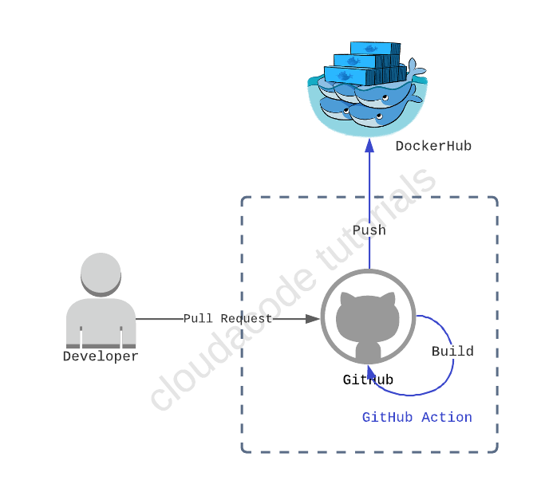
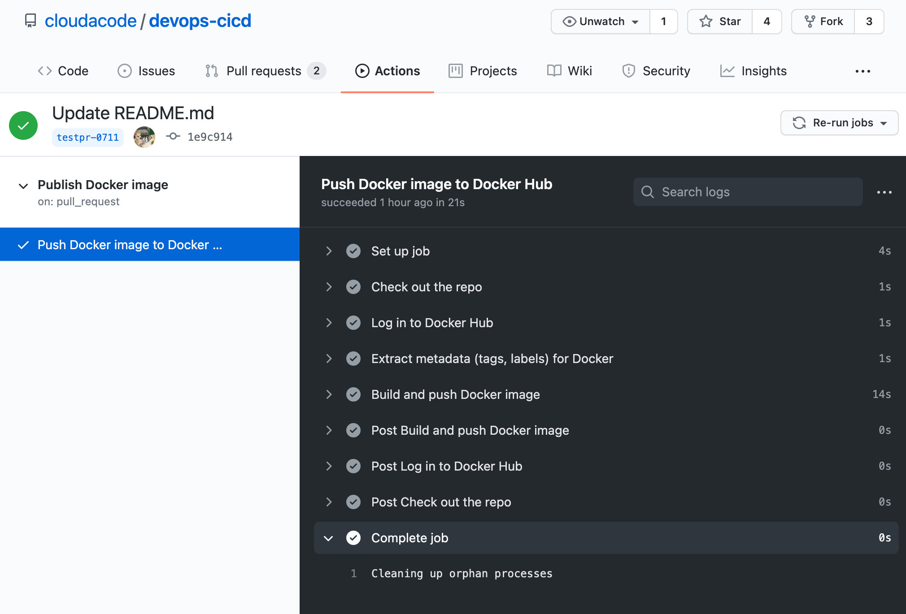

# Publishing Docker images - GitHub Action

**개발 빌드 환경 구성 및 Container 빌드 자동화 실습**

[GitHub Action](https://docs.github.com/en/actions)을 master 혹은 main branch로 코드가 커밋이 되면 어플리케이션을 도커로 빌드 자동화 및 도커 레지스트리([hub.docker.com](https://hub.docker.com/)) 에 이미지 등록

**Time to Complete: 1 hour**

**Tutorial Prereqs:**

* **An Administrator-level for GitHub Repo**
* **Understand what is the GitHub Actions**

<iframe width="560" height="315" src="https://www.youtube.com/embed/cP0I9w2coGU" title="YouTube video player" frameborder="0" allow="accelerometer; autoplay; clipboard-write; encrypted-media; gyroscope; picture-in-picture" allowfullscreen></iframe>

## System Architecture


## 1. Create encrypted secrets for a GitHub Repo

[creating-encrypted-secrets-for-a-repository](https://docs.github.com/en/actions/reference/encrypted-secrets#creating-encrypted-secrets-for-a-repository)

- Name: `DOCKER_USERNAME`, Vaule: `Your DockerHub Account Name`
- Name: `DOCKER_PASSWORD`, Value: `Your DockerHub Password`

## 2. Create a workflow to use actions

최상위 디렉토리 `.github/workflows/github-actions-dockerhub.yml`에 workflow 스펙을 아래와 같이 명시

```yaml
name: Publish Docker image

on:
  pull_request:
    types: [assigned, opened, synchronize, reopened]

jobs:
  push_to_registry:
    name: Push Docker image to Docker Hub
    runs-on: ubuntu-latest
    steps:
      - name: Check out the repo
        uses: actions/checkout@v3

      - name: Log in to Docker Hub
        uses: docker/login-action@f4ef78c080cd8ba55a85445d5b36e214a81df20a
        with:
          username: ${{ secrets.DOCKER_USERNAME }}
          password: ${{ secrets.DOCKER_PASSWORD }}

      - name: Extract metadata (tags, labels) for Docker
        id: meta
        uses: docker/metadata-action@9ec57ed1fcdbf14dcef7dfbe97b2010124a938b7
        with:
          images: dockerhub-namespace/dockerhub-repository

      - name: Build and push Docker image
        uses: docker/build-push-action@3b5e8027fcad23fda98b2e3ac259d8d67585f671
        with:
          context: .
          file: ./Dockerfile
          push: true
          tags: ${{ steps.meta.outputs.tags }}
          labels: ${{ steps.meta.outputs.labels }}
```

Line 25 번째 줄에 본인의 `dockerhub-namespace/repo-name` 으로 변경후 code commit & main branch에 merge

## 3. Verify GitHub Action

- Git Branch 생성 후 코드 수정 및 Commit
- GitHub에서 Main Branch로 Pull Request 수행
- Pull Request 진행 화면에서 Github Action이 동작 하는지 확인


## 4. Verify DockerHub image

이미지가 정상적으로 본인 Repo에 업로드 되었는지 확인
https://hub.docker.com

!!! Note
    workflow 스펙 파일에서 별도로 tag를 지정 하지 않았다면 pr 번호가 image tag로 부여됨

## Reference
- https://docs.github.com/en/actions/guides/publishing-docker-images


🎉 Congratulations, you have completed Publishing Docker images - GitHub Action tutorial
