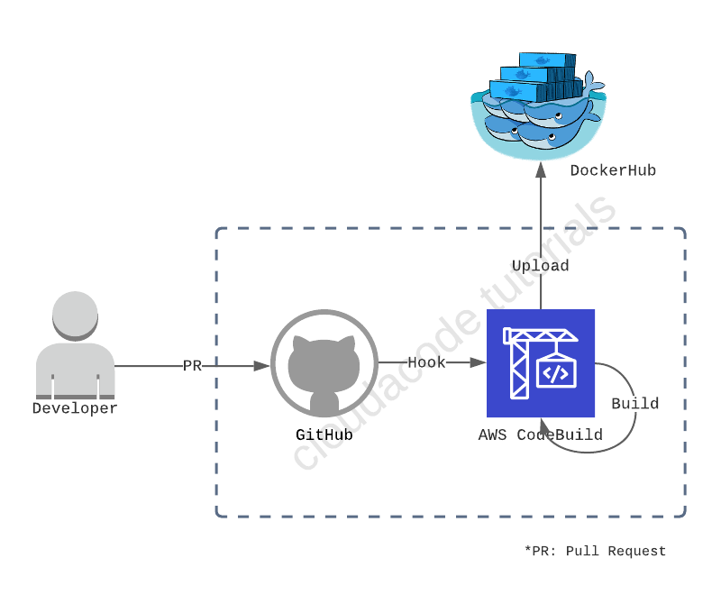
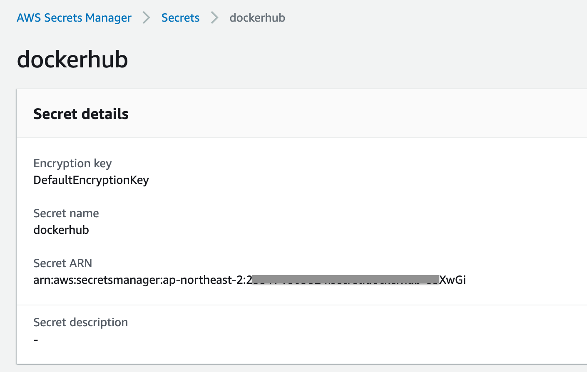
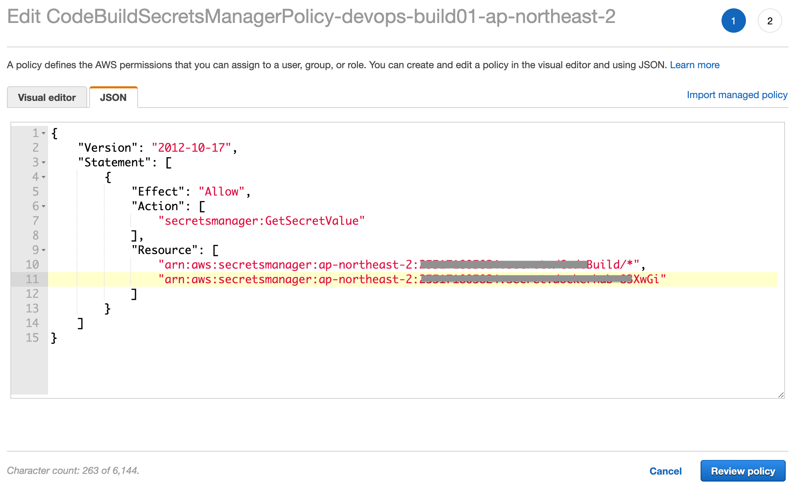
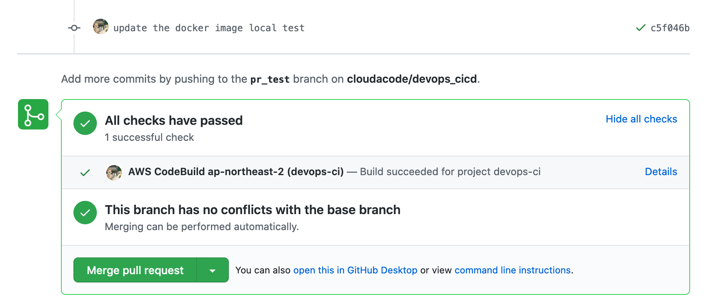

# Publishing Docker images - AWS CodeBuild

**개발 빌드 환경 구성 및 Container 빌드 자동화 실습**

CI 도구([aws codebuild](https://aws.amazon.com/codebuild/))를 통해 소스 관리 하고 master로 Pull Request가 되면 어플리케이션을 도커로 빌드 자동화, 도커 레지스트리([hub.docker.com](https://hub.docker.com/)) 에 이미지 등록

**Time to Complete: 2-3 hours**

**Tutorial Prereqs:**

* **An AWS Account and Administrator-level or PowerUser-level access to it**

## System Architecture


<div>
<a id="channel-add-button" target="_blank" href="http://pf.kakao.com/_nxoaTs">
  
</a>
<a class="github-button" href="https://github.com/cloudacode/tutorials" data-icon="octicon-star" data-size="large" data-show-count="true" aria-label="Star cloudacode/tutorials on GitHub">Star</a>
</div>

## 1. Create an AWS CodeBuild Project

### Make a BuildSpec file for CodeBuild

최상위 디렉토리에 CodeBuild의 작업을 정의한 `buildspec.yml`를 생성

[Build Specification reference 문서](https://docs.aws.amazon.com/ko_kr/codebuild/latest/userguide/build-spec-ref.html)

예시)
```yaml
version: 0.2

phases:
  pre_build:
    commands:
      - echo Logging in to Docker Hub...
      - docker login -u $DOCKERHUB_USER -p $DOCKERHUB_PW
      - TAG=$TAG_VERSION
  build:
    commands:
      - echo Build started on `date`
      - echo Building the Docker image...
      - docker build -t $IMAGE_REPO_NAME:$TAG .
      - docker tag $IMAGE_REPO_NAME:$TAG $IMAGE_REPO_NAME:$TAG
  post_build:
    commands:
      - echo Build completed on `date`
      - echo Pushing the Docker image...
      - docker push $IMAGE_REPO_NAME:$TAG
```

만약 TAG 버전을 unique한 commit hash로 저장 하고 싶다면 
```yaml
      - TAG="$(echo $CODEBUILD_RESOLVED_SOURCE_VERSION | head -c 8)"
```

### Setup the codebuild

https://ap-northeast-2.console.aws.amazon.com/codesuite/codebuild/projects

1. 소스: Github, 내 GitHub 계정의 리포지토리
   - GitHub Personal access token 생성 필요: [참고](https://docs.github.com/en/free-pro-team@latest/github/authenticating-to-github/creating-a-personal-access-token)
   - 권한은 repo, admin:repo_hook [참고](https://docs.aws.amazon.com/codebuild/latest/userguide/access-tokens.html#access-tokens-github)
2. Webhook: 코드 변경이 이 리포지토리에 푸시될 때마다 다시 빌드
3. 이벤트 유형: `PULL_REQUEST_CREATED`, `PULL_REQUEST_UPDATED`, `PULL_REQUEST_REOPENED`
   - 특정 Branch 이름이나 Tag로 이벤트를 감지 하고 싶다면 `Start a build under these condition`에 필터 추가 [참고 문서](https://docs.aws.amazon.com/codebuild/latest/userguide/github-webhook.html)
   e.g., feature/ 브랜치 이벤트만 `HEAD_REF: ^refs/heads/feature/*`
4. 환경: 관리형 이미지, Ubuntu, Standard, aws/codebuild/standard:5.0, 권한 승격 활성화 (Enable this flag if you want to build Docker images or want your builds to get elevated privileges)
5. 서비스 역할: 새 서비스 역할 (Name: default e.g., codebuild-*[project_name]*-service-role)
   
!!! Note
      CodeBuild 프로젝트 생성 후 IAM에서 추후 업데이트 필요

6. Additional configuration 에 환경 변수 설정:
   
   - TAG_VERSION(*일반 텍스트*): `latest` , 위에서 TAG_VERSION을 commit hash로 받는 설정을 하였을 경우는 설정 필요 없음
   - IMAGE_REPO_NAME(*일반 텍스트*): `[Docker Repo Name]` e.g., cloudacode/devops-flask
   - DOCKERHUB_USER(*Secrets Manager*): `dockerhub:username`
   - DOCKERHUB_PW(*Secrets Manager*): `dockerhub:password`
   
!!! Note
      username, password 보안을 위해 Secrets Manager를 활용하여 암호 관리 필요. [참고](https://aws.amazon.com/premiumsupport/knowledge-center/codebuild-docker-pull-image-error/?nc1=h_ls#Store_your_DockerHub_credentials_with_AWS_Secrets_Manager) 

7. BuildSpec: default(빈칸) 혹은 `buildspec.yml` 입력
   - 상위 디렉토리에 buildspec.yml이라는 파일로 이름을 정했으므로 별도의 입력값 필요 없음
8. Artifact: 없음
9. CloudWatch: Default(CloudWatch 로그 선택)

## 2. Configure Secrets Manager 
Go to [SecretsManager](https://ap-northeast-2.console.aws.amazon.com/secretsmanager/home) console

[DockerHub 자격 증명저장](https://aws.amazon.com/premiumsupport/knowledge-center/codebuild-docker-pull-image-error/?nc1=h_ls#Store_your_DockerHub_credentials_with_AWS_Secrets_Manager)

Store a new secret
   - Type: Other type of Secrets
   - Secret key/vale에 username: `DOCKERHUB 계정이름`, password: `DOCKERHUB 계정패스워드` 입력
   - Secret Name: `dockerhub`

## 3. Configure IAM policy

SecretManager에서 정의한 dockerhub secret도 읽는 권한을 부여 하기 위해 
`CodeBuildSecretsManagerPolicy-[codebuild project name]-ap-northeast-2`의 Resource에 secretsmanager dockerhub ARN 추가 필요

### Confirm the dockerhub secrets ARN

Go to [Secertmanager dockerhub ARN](https://ap-northeast-2.console.aws.amazon.com/secretsmanager/home?region=ap-northeast-2#/secret?name=dockerhub)



### Add the dockerhub secrets resource in IAM Policy

Go to [IAM Policy](https://console.aws.amazon.com/iam/home?region=ap-northeast-2#/policies) console

Search `CodeBuildSecretsManagerPolicy-[codebuild project name]-ap-northeast-2` and edit



## 4. Verify Codebuild Job manually

수동으로 수행 및 콘솔에서 확인
Go to [codebuild projects](https://ap-northeast-2.console.aws.amazon.com/codesuite/codebuild/projects)

### DockerHub image 

이미지가 정상적으로 업로드 되었는지 확인 
https://hub.docker.com

### Pull Request 테스트

별도의 Branch를 만들어 app.py의 Hello World 리턴값 변경 후 main으로 PR 수행

CI 도구가 변경 사항을 인지하여 자동으로 수행 되는지 확인

🎉 Congratulations, you have completed Publishing Docker images - AWS CodeBuild tutorial 

이 글이 유용하였다면 ⭐ Star를, 💬 1:1 질문이나 기술 관련 문의가 필요하신 분들은 클라우드어코드 카카오톡 채널 추가 부탁드립니다.🤗

<div>
<a id="channel-add-button" target="_blank" href="http://pf.kakao.com/_nxoaTs">
  
</a>
<a class="github-button" href="https://github.com/cloudacode/tutorials" data-icon="octicon-star" data-size="large" data-show-count="true" aria-label="Star cloudacode/tutorials on GitHub">Star</a>
</div>

<script async defer src="https://buttons.github.io/buttons.js"></script>

## 참고 자료
- https://docs.aws.amazon.com/ko_kr/whitepapers/latest/introduction-devops-aws/introduction-devops-aws.pdf
- https://docs.aws.amazon.com/ko_kr/whitepapers/latest/practicing-continuous-integration-continuous-delivery/practicing-continuous-integration-continuous-delivery.pdf
- https://docs.aws.amazon.com/ko_kr/codebuild/latest/userguide/sample-docker.html
- https://docs.aws.amazon.com/ko_kr/codebuild/latest/userguide/github-webhook.html
