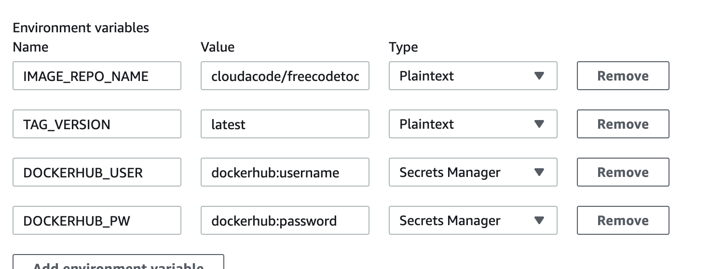
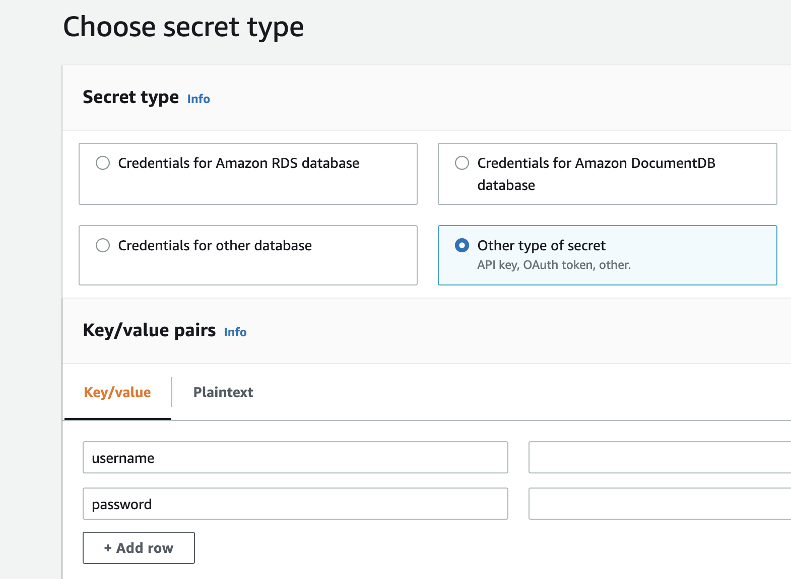

# Publishing Docker images - AWS CodeBuild

**개발 빌드 환경 구성 및 Container 빌드 자동화 실습**

[CodeBuild](https://aws.amazon.com/codebuild/)를 통해 코드의 Pull Request가 일어나면 도커 빌드 및 [레지스트리](https://hub.docker.com/)에 이미지 등록 자동화 실습

**Time to Complete: 2-3 hours**

**Tutorial Prereqs:**

* **An AWS Account and Administrator-level or PowerUser-level access to it**
* **Fork [cloudacode/FlaskIntroduction](https://github.com/cloudacode/FlaskIntroduction) Repository**

## System Architecture


<div>
<a id="channel-add-button" target="_blank" href="http://pf.kakao.com/_nxoaTs">
  
</a>
<a class="github-button" href="https://github.com/cloudacode/tutorials" data-icon="octicon-star" data-size="large" data-show-count="true" aria-label="Star cloudacode/tutorials on GitHub">Star</a>
</div>

## 1. Create an AWS CodeBuild Project

### Make a BuildSpec file for CodeBuild

최상위 디렉토리에 CodeBuild의 작업을 정의한 `buildspec.yml`를 생성

[Build Specification reference 문서](https://docs.aws.amazon.com/ko_kr/codebuild/latest/userguide/build-spec-ref.html)

예시)
```yaml
version: 0.2

phases:
  pre_build:
    commands:
      - echo Logging in to Docker Hub...
      - docker login -u $DOCKERHUB_USER -p $DOCKERHUB_PW
      - TAG=$TAG_VERSION
  build:
    commands:
      - echo Build started on `date`
      - echo Building the Docker image...
      - docker build -t $IMAGE_REPO_NAME:$TAG .
      - docker tag $IMAGE_REPO_NAME:$TAG $IMAGE_REPO_NAME:$TAG
  post_build:
    commands:
      - echo Build completed on `date`
      - echo Pushing the Docker image...
      - docker push $IMAGE_REPO_NAME:$TAG
```

만약 TAG 버전을 unique한 commit hash로 저장 하고 싶다면
```yaml
      - TAG="$(echo $CODEBUILD_RESOLVED_SOURCE_VERSION | head -c 8)"
```

### Setup the codebuild

Go to [CodeBuild](https://ap-northeast-2.console.aws.amazon.com/codesuite/codebuild/projects) console

1. **Project configuration**
    - Project 이름 입력
    - Enable build badge 활성화
2. **Source**
    - Connecting using OAuth 로 GitHub과 연동
    - 만약, Personal access token으로 진행시 GitHub Personal access token 생성 필요 [참고](https://docs.github.com/en/free-pro-team@latest/github/authenticating-to-github/creating-a-personal-access-token) 및 권한은 repo, admin:repo_hook [참고](https://docs.aws.amazon.com/codebuild/latest/userguide/access-tokens.html#access-tokens-github)
3. **Primary source webhook events**
    - Webhook: 코드 변경이 이 리포지토리에 푸시될 때마다 다시 빌드
    - Event Type: `PULL_REQUEST_CREATED`, `PULL_REQUEST_UPDATED`, `PULL_REQUEST_REOPENED`
    - 만약, 특정 Branch 이름이나 Tag로 이벤트를 감지 하고 싶다면 `Start a build under these condition`에 필터 추가 [참고 문서](https://docs.aws.amazon.com/codebuild/latest/userguide/github-webhook.html)
   e.g., feature/ 브랜치 이벤트만 `HEAD_REF: ^refs/heads/feature/*`
4. **환경(Environment)**
    - Environment image: 관리형 이미지, Amazon Linux 2, Standard, aws/codebuild/amazonlinux2-x86_64-standard:4.0
    - Privileged: 권한 승격 활성화 (Enable this flag if you want to build Docker images or want your builds to get elevated privileges)
    - 서비스 역할: 새 서비스 역할 (Name: default e.g., codebuild-*[project_name]*-service-role)
    - Additional configuration 에 환경 변수 설정:
        - TAG_VERSION(*일반 텍스트*): `latest` , 위에서 TAG_VERSION을 commit hash로 받는 설정을 하였을 경우는 설정 필요 없음
        - IMAGE_REPO_NAME(*일반 텍스트*): `Docker Repo Name` e.g., cloudacode/devops-flask
        - DOCKERHUB_USER(*Secrets Manager*): `dockerhub:username`
        - DOCKERHUB_PW(*Secrets Manager*): `dockerhub:password`
        
        !!! Note
              username, password 보안을 위해 Secrets Manager를 활용하여 암호 관리 필요. [참고](https://aws.amazon.com/premiumsupport/knowledge-center/codebuild-docker-pull-image-error/?nc1=h_ls#Store_your_DockerHub_credentials_with_AWS_Secrets_Manager)
5. **BuildSpec**
    - 상위 디렉토리에 buildspec.yml이라는 파일로 이름을 정했으므로 별도의 입력값 필요 없음
6. **Artifact**: 없음
7. **CloudWatch**: Default(CloudWatch 로그 선택)

## 2. Configure Secrets Manager
Go to [SecretsManager](https://ap-northeast-2.console.aws.amazon.com/secretsmanager/home) console

Store a new secret

  - Type: Other type of Secrets
  - Secret key/vale에 username: `DOCKERHUB 계정이름`, password: `DOCKERHUB 계정패스워드` 입력
  - Secret Name: `dockerhub`
  

참고: [DockerHub 자격 증명저장](https://aws.amazon.com/premiumsupport/knowledge-center/codebuild-docker-pull-image-error/?nc1=h_ls#Store_your_DockerHub_credentials_with_AWS_Secrets_Manager)

## 3. Configure IAM policy
SecretManager에서 정의한 dockerhub secret도 읽는 권한을 부여 하기 위해
`CodeBuildSecretsManagerPolicy-<YOUR_BUILD_PROJECT_NAME>-ap-northeast-2`의 Resource에 secretsmanager dockerhub ARN 추가

### Confirm the dockerhub secrets ARN

Go to [Secertmanager dockerhub ARN](https://ap-northeast-2.console.aws.amazon.com/secretsmanager/home?region=ap-northeast-2#/secret?name=dockerhub)


### Add the dockerhub secrets resource in IAM Policy

Go to [IAM Policy](https://console.aws.amazon.com/iam/home?region=ap-northeast-2#/policies) console

`CodeBuildSecretsManagerPolicy-<YOUR_BUILD_PROJECT_NAME>-ap-northeast-2` 에서 수정 진행(JSON에서 Resource의 마지막 줄에 추가)


## 4. Verify Codebuild Job manually

수동으로 수행 및 [Codebuild](https://ap-northeast-2.console.aws.amazon.com/codesuite/codebuild/projects) 콘솔에서 확인

### DockerHub image

이미지가 정상적으로 [DockerHub](https://hub.docker.com)에 업로드 되었는지 확인


### Pull Request 테스트

별도의 Branch를 만들어 static/css/main.css의 backgroud-color 수정 후 main으로 PR 수행 및 CI 도구가 변경 사항을 인지하여 자동으로 수행 되는지 확인


🎉 Congratulations, you have completed Publishing Docker images - AWS CodeBuild tutorial

이 글이 유용하였다면 ⭐ Star를, 💬 1:1 질문이나 기술 관련 문의가 필요하신 분들은 클라우드어코드 카카오톡 채널 추가 부탁드립니다.🤗

<div>
<a id="channel-add-button" target="_blank" href="http://pf.kakao.com/_nxoaTs">
  
</a>
<a class="github-button" href="https://github.com/cloudacode/tutorials" data-icon="octicon-star" data-size="large" data-show-count="true" aria-label="Star cloudacode/tutorials on GitHub">Star</a>
</div>

<script async defer src="https://buttons.github.io/buttons.js"></script>

## 참고 자료
- https://docs.aws.amazon.com/ko_kr/whitepapers/latest/introduction-devops-aws/introduction-devops-aws.pdf
- https://docs.aws.amazon.com/ko_kr/whitepapers/latest/practicing-continuous-integration-continuous-delivery/practicing-continuous-integration-continuous-delivery.pdf
- https://docs.aws.amazon.com/ko_kr/codebuild/latest/userguide/sample-docker.html
- https://docs.aws.amazon.com/ko_kr/codebuild/latest/userguide/github-webhook.html
