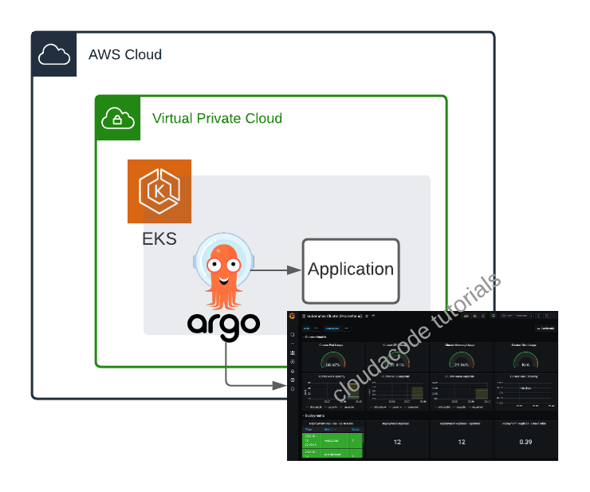
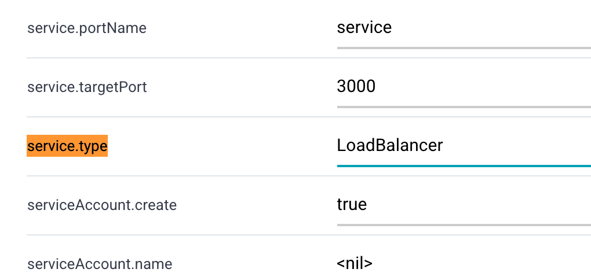
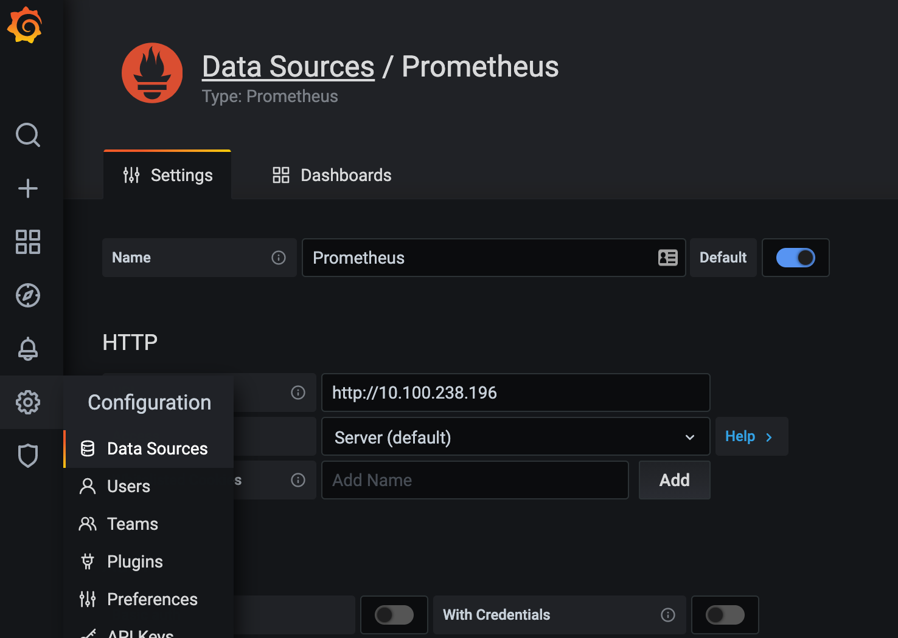
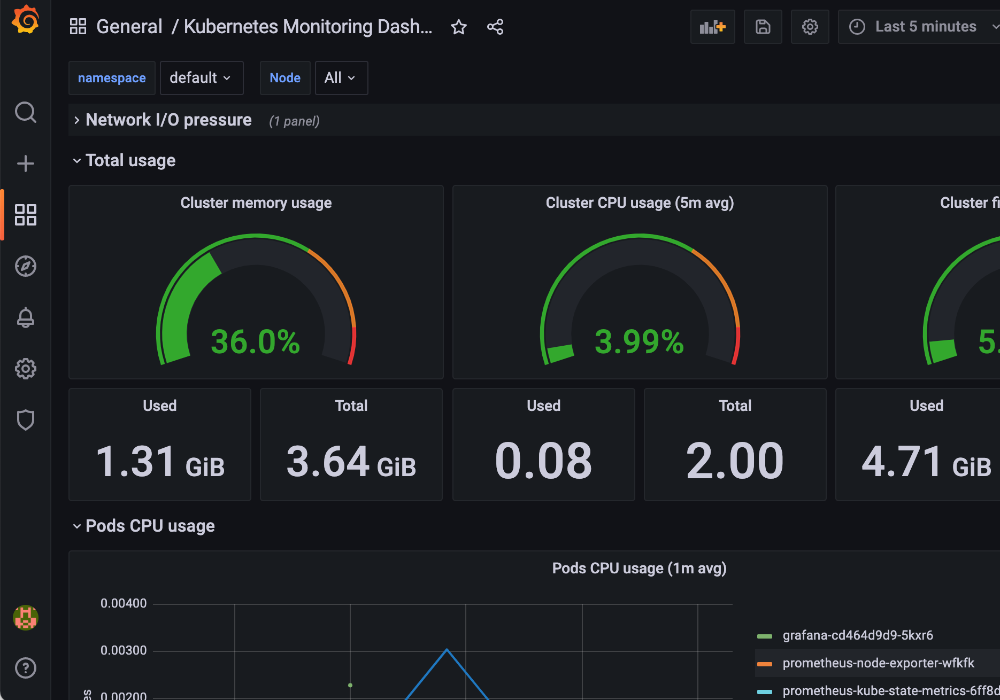

# Implement an ArgoCD, Deploy Monitoring Pipeline

**Kuberentes에 ArgoCD 연동 및 Grafana, Prometheus로 모니터링 파이프라인 구성**

이번 실습은 쿠버네틱스에 ArgoCD를 연동하여 어플리케이션을 배포 해보고 모니터링 파이프라인을 구성 해보는 실습 입니다. 쿠버네틱스에 서비스의 배포 관리를 할수 있는 도구인 ArgoCD에 대한 특성과 실제 모니터링 파이프라인을 구성해 보면서 모니터링 방법에 대해 이해 할 수 있습니다.

## 사전 준비 사항

### AWS EKS 구성

Amazon EKS 구성: [관련 링크](../cloud/aws/amazon-eks-setup.md)

## Architecture


## ArgoCD 연동

### ArgoCD CLI 설치
https://argoproj.github.io/argo-cd/cli_installation/

### ArgoCD 설치
https://argoproj.github.io/argo-cd/getting_started/

```
kubectl create namespace argocd
kubectl apply -n argocd -f https://raw.githubusercontent.com/argoproj/argo-cd/stable/manifests/install.yaml
```
This will create a new namespace, `argocd`, where Argo CD services and application resources will live.

### ArgoCD CLI 설치

Download the latest Argo CD version from [https://github.com/argoproj/argo-cd/releases/latest](https://github.com/argoproj/argo-cd/releases/latest). 

More detailed installation instructions can be found via the [CLI installation documentation](https://github.com/argoproj/argo-cd/blob/master/docs/cli_installation.md).

### ArgoCD Server 접속
In order to access server via URL, need to expose the Argo CD API server. Change the argocd-server service type to `LoadBalancer`:

```bash
kubectl patch svc argocd-server -n argocd -p '{"spec": {"type": "LoadBalancer"}}'
```
LB Endpoint를 노출 하더라도 도메인 등록 시간이 소요 되므로 브라우저를 통한 접근이 가능하기 까지는 약 5분 소요

Check the LB Endpoint

```bash
kubectl get -n argocd svc argocd-server    
NAME            TYPE           CLUSTER-IP       EXTERNAL-IP                                                                    PORT(S)                      AGE
argocd-server   LoadBalancer   10.100.143.242   a1521dde2ec114a4eb7fb04632cab058-1608723687.ap-northeast-2.elb.amazonaws.com   80:32511/TCP,443:31088/TCP   17m
```

Also available to get the external LB endpoint as a raw value:

```bash
kubectl get -n argocd svc argocd-server --output jsonpath='{.status.loadBalancer.ingress[0].hostname}'
```

초기 `admin` 패스워드 확인 
```bash
kubectl -n argocd get secret argocd-initial-admin-secret -o jsonpath="{.data.password}" | base64 -d
```
https://argoproj.github.io/argo-cd/getting_started/#4-login-using-the-cli


브라우저를 통해 LB Endpoint 에 접속

!!! note
    SSL인증서 연동을 하지 않아 브라우저에서 사이트가 안전하지 않는다는 메시지가 발생하기 때문에 실습 때는 무시하고 진행한다.


## ArgoCD를 통해 모니터링 App(Prometheus, Grafana) 배포

웹 콘솔에 접속후 __+ New App__ 클릭하여 신규 애플리케이션(Prometheus) 생성

- GENERAL
  - Application Name: prometheus
  - Project: default
  - Sync Policy: Manual
- SOURCE
  - Repo URL: https://prometheus-community.github.io/helm-charts `HELM`
  - Chart: prometheus `13.6.0`
- DESTINATION
  - Cluster URL: https://kubernetes.default.svc
  - Namespace: default

__Create__ 진행 후

화면을 새로고침 하면 다음과 같이 앱이 하나 등록 되어 Sync가 아직 되지 않은 OutOfSync 상태로 확인 된다. Sync 정책을 Manual 로 하였기 때문에 초기에 OutOfSync 상태는 정상 이다.

__SYNC__ 수행 후

레포지토리 URL 이 올바르게 되어 있다면 문제 없이 sync가 완료되고 상세 페이지 역시 아래처럼 확인 가능하다 
 

Prometheus의 ClusterIP 확인

```bash
kubectl get svc prometheus-server
NAME                TYPE        CLUSTER-IP       EXTERNAL-IP   PORT(S)   AGE
prometheus-server   ClusterIP   10.100.238.196   <none>        80/TCP    5m44s
```

다시 웹 콘솔에서 __+ New App__ 클릭하여 신규 애플리케이션(Grafana) 생성

- GENERAL
  - Application Name: grafana
  - Project: default
  - Sync Policy: Manual
- SOURCE
  - Repo URL: https://grafana.github.io/helm-charts `HELM`
  - Chart: prometheus `6.6.2`
- DESTINATION
  - Cluster URL: https://kubernetes.default.svc
  - Namespace: default

아래 HELM 변수값 탭에서 `service.type` 검색 후 값을 `LoadBalancer` 로 변경


__Create__ 와 __SYNC__ 수행 후 정상적으로 애플리케이션이 만들어졌다면 admin password를 조회

```bash
kubectl get secret --namespace default grafana -o jsonpath="{.data.admin-password}" | base64 --decode ; echo
```

Endpoint 확인을 위해 ArgoCD 화면에서 Grafana 선택 후 상세페이지
__Service__(화면에서는 svc grafana)의 Hostnames 항목에 앱에 접속 가능한 LB URL이 생성 되었는지 확인 후 웹 브라우져를 통해 해당 URL로 접속하여 Grafana에 접근


### Monitoring Dashboard 구성  

왼쪽 텝 __Configuration__ 에서 Data Sources 선택 후 위에서 조회한 Prometheus Cluster IP를 HTTP URL로 지정

SAVE & TEST 하여 Data Source 등록


왼쪽 텝 __+__ Import -> Upload Json File:
[kubernetes-cluster-prometheus_rev1.json](assets/kubernetes-cluster-prometheus_rev1.json) 업로드

Options
  - prometheus: `Promethesus`

아래처럼 리소스에 대한 모니터링 대쉬보드 확인



## Clean Up
실습 완료 후 비용 절약을 위해 실습한 EKS 리소스를 정리
```
eksctl delete cluster --region=ap-northeast-2 --name=<your eks cluster name>
```

## Reference
https://argoproj.github.io/argo-cd/getting_started
