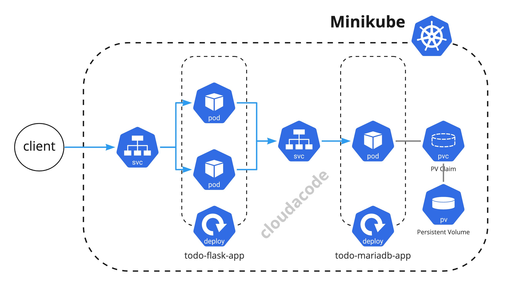
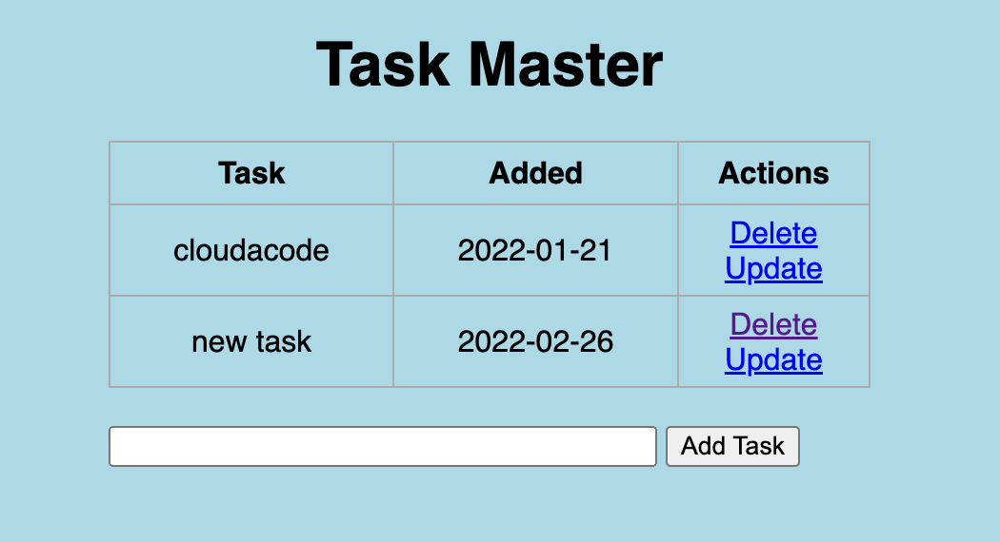

# Deploy Todo App locally via Minikube

**Minikube를 활용하여 로컬환경에 Todo App 배포**

이번 실습은 쿠버네티스에 Python flask 어플리케이션과 mariaDB를 배포 해보고 접근 해보는 실습 입니다. 쿠버네티스에 DB용 영구볼륨(PersistentVolume)구성 방법 및 어플리케이션 배포 방법과 서비스 노출 방법에 대해 이해 할 수 있습니다.

## 사전 준비 사항

### Minikube 구성

Minikube 구성: [관련 링크](https://minikube.sigs.k8s.io/docs/start/)

## Architecture


<div>
<a id="channel-add-button" target="_blank" href="http://pf.kakao.com/_nxoaTs">
  
</a>
<a class="github-button" href="https://github.com/cloudacode/tutorials" data-icon="octicon-star" data-size="large" data-show-count="true" aria-label="Star cloudacode/tutorials on GitHub">Star</a>
</div>

## Minikube에 Application 배포

### Minikube 실행

Run `minikube start` to start minikube locally

### Todo Data Volume 생성

Run `kubectl apply -f todo-mariadb-pv.yaml` to create persistent data volume for the mariadb.

todo-mariadb-pv.yaml
```yaml
apiVersion: v1
kind: PersistentVolume
metadata:
  name: task-data-volume
  labels:
    classname: mini
spec:
  storageClassName: mini
  accessModes:
    - ReadWriteOnce
  capacity:
    storage: 1Gi
  hostPath:
    path: /data/task-data/
---
apiVersion: v1
kind: PersistentVolumeClaim
metadata:
  name: task-data-claim
  labels:
    classname: mini
spec:
  storageClassName: mini
  accessModes:
    - ReadWriteOnce
  resources:
    requests:
      storage: 500Mi
```

Run `kubectl get pv,pvc -l classname=mini ` to verify the pv and pvc are created properly

```bash
$ kubectl get pv,pvc -l classname=mini
NAME                                CAPACITY   ACCESS MODES   RECLAIM POLICY   STATUS   CLAIM                     STORAGECLASS   REASON   AGE
persistentvolume/task-data-volume   1Gi        RWO            Retain           Bound    default/task-data-claim   mini                    11s

NAME                                    STATUS   VOLUME             CAPACITY   ACCESS MODES   STORAGECLASS   AGE
persistentvolumeclaim/task-data-claim   Bound    task-data-volume   1Gi        RWO            mini           11s
```

### Todo App용 Mariadb 배포

Source code: [cloudacode/coolstuff/todo-mariadb](https://github.com/cloudacode/coolstuff/tree/main/todo-app/mariadb-app)

Run `kubectl apply -f todo-mariadb-app.yaml` to deploy mariadb and service endpoint

todo-mariadb-app.yaml
```yaml
---
apiVersion: apps/v1
kind: Deployment
metadata:
  name: mysql
spec:
  selector:
    matchLabels:
      app: mysql
  strategy:
    type: Recreate
  template:
    metadata:
      labels:
        app: mysql
    spec:
      containers:
      - image: cloudacode/mariadb-todo:v1.0.1
        name: mysql
        ports:
        - containerPort: 3306
          name: mysql
---
apiVersion: v1
kind: Service
metadata:
  name: mysql
spec:
  ports:
  - port: 3306
  selector:
    app: mysql
  clusterIP: None
```

### Todo App용 Flask 배포

Source code: [cloudacode/coolstuff/todo-flask-app](https://github.com/cloudacode/coolstuff/tree/main/todo-app/flask-app)

Run `kubectl apply -f todo-flask-app.yaml` to deploy flask app and service endpoint

todo-flask-app.yaml
```yaml
---
apiVersion: apps/v1
kind: Deployment
metadata:
  name: todo-app
  labels:
    app: todo-app
spec:
  replicas: 1
  selector:
    matchLabels:
      app: todo-app
  strategy:
    rollingUpdate:
      maxSurge: 1
      maxUnavailable: 0
    type: RollingUpdate
  template:
    metadata:
      labels:
        app: todo-app
    spec:
      containers:
      - image: cloudacode/python-todo:v1.1.0
        imagePullPolicy: Always
        name: todo-app
        ports:
        - containerPort: 5000
          protocol: TCP
        env:
        - name: DB_USER
          value: root
        - name: DB_PASSWORD
          value: mysecret
        - name: DB_NAME
          value: todo
        - name: DB_HOST
          value: mysql
---
apiVersion: v1
kind: Service
metadata:
  name: todo-app-svc
spec:
  selector:
    app: todo-app
  ports:
   -  protocol: TCP
      port: 80
      targetPort: 5000
  type: LoadBalancer
```

Run `kubectl get svc` in check the exposed service. you may see the `EXTERNAL-IP` is `pending` status due to minikube doesn't have extra LB. 

```bash
kubectl get svc todo-app-svc
NAME           TYPE           CLUSTER-IP       EXTERNAL-IP   PORT(S)        AGE
todo-app-svc   LoadBalancer   10.102.161.248   <pending>     80:31289/TCP   54s
```

You should use the `minikube tunnel` to get the external-ip for the service. [Loadbalancer Access](https://minikube.sigs.k8s.io/docs/handbook/accessing/#loadbalancer-access)

### Minikube tunnel 설정

Run `minikube tunnel` in a *seperate terminal* to enable external-ip

```bash
minikube tunnel
❗  The service todo-app-svc requires privileged ports to be exposed: [80]
🔑  sudo permission will be asked for it.
🏃  Starting tunnel for service todo-app-svc.
Password:

```

Run `kubectl get svc todo-app-svc` in check the external-ip and it will be 

```bash
kubectl get svc todo-app-svc
NAME           TYPE           CLUSTER-IP       EXTERNAL-IP   PORT(S)        AGE
todo-app-svc   LoadBalancer   10.102.161.248   127.0.0.1     80:31289/TCP   5m41s
``` 

### Todo App 접근

Open `http://127.0.0.1` in your favorite web browser and check the flask todo app



### Todo App 리소스 확장

Run `kubectl scale --replicas=3 deployment/todo-app` to scale out the app

```
$ kubectl scale --replicas=3 deployment/todo-app
deployment.apps/todo-app scaled
$ kubectl get pods
NAME                        READY   STATUS              RESTARTS   AGE
mysql-8bb5f69f8-cs55w       1/1     Running             0          10m
todo-app-576d68cf7f-cf74w   1/1     Running             0          5s
todo-app-576d68cf7f-mskbm   1/1     Running             0          7m16s
todo-app-576d68cf7f-w8x8q   0/1     ContainerCreating   0          5s
```

## Clean Up
배포한 리소스(deployments, service) 정리

```
$ kubectl delete -f todo-flask-app.yaml
$ kubectl delete -f todo-mariadb-app.yaml
```


이 글이 유용하였다면 ⭐ Star를, 💬 1:1 질문이나 기술 관련 문의가 필요하신 분들은 클라우드어코드 카카오톡 채널 추가 부탁드립니다.🤗

<div>
<a id="channel-add-button" target="_blank" href="http://pf.kakao.com/_nxoaTs">
  
</a>
<a class="github-button" href="https://github.com/cloudacode/tutorials" data-icon="octicon-star" data-size="large" data-show-count="true" aria-label="Star cloudacode/tutorials on GitHub">Star</a>
</div>

<script async defer src="https://buttons.github.io/buttons.js"></script>
