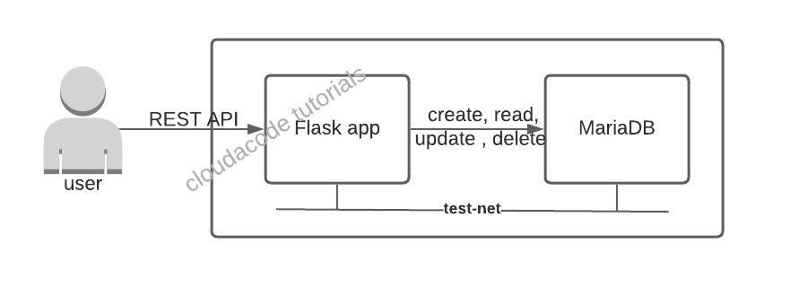

# A Simple REST Flask APP with MariaDB Container

In this tutorial, you will learn how to build a Flask web application and implement the app with database(MariaDB). using postman to test basic REST APIs(HTTP methods: GET, POST, DELETE). 

Flask로 Web App을 개발을 하고 데이터베이스와 연동을 하는 방법을 알아본다. Postman을 사용 하여 기본적인 REST API(HTTP methods: GET, POST, DELETE)를 테스트 해본다.  

**Time to Complete: 1-2 hours**

**Tutorial Prereqs:**

- Download stable [POSTMAN](https://www.postman.com/downloads/)
- Python 3.x
- Python Library [requirement.txt](https://github.com/cloudacode/coolstuff/blob/main/simple-flask-app/requirements.txt)
  
        flask
        pymysql
        flask_table
        flask-mysql

- Download stable [Docker](https://docs.docker.com/get-docker/)

## Architecture



## 1. Create a container test network

```bash
docker network create test-net
```
`test-net` is newly created docker network for this tutorial (other than bridge as the default network)

## 2. Provision a DB container

### Start predefined mariadb container

```bash
docker run -p 3306:3306 --name my-mariadb --net test-net -d cloudacode/mariadb:v1.1.0
```

dockerfile of the cloudacode/mariadb: [simple-mariadb-container](https://github.com/cloudacode/coolstuff/tree/main/simple-mariadb-container)

!!! Note
    If you want to setup the database by yourself, please follow below guideline.

### (Optional) Start a mariadb instance from scratch

#### Deploy new MariaDB container

```bash
docker run -p 3306:3306 --name my-mariadb --net test-net -e MYSQL_ROOT_PASSWORD=mysecret -e MYSQL_DATABASE=cloud_user -d mariadb:latest
``` 

!!! Note
    mariadb official repo: https://hub.docker.com/_/mariadb

#### Initalize the database

connect to db container and database
```bash
docker exec -it my-mariadb /bin/bash
```

If you can see `root@b51599196adf:/#` in your terminal, it means you are in the container.

login the database via mysql client and initialize the database

```bash
mysql -uroot -pmysecret
```

```bash
MariaDB [(none)]> use cloud_user;
Database changed
MariaDB [cloud_user]>
MariaDB [cloud_user]> CREATE TABLE IF NOT EXISTS `cloud_user` (  
    `user_id` bigint NOT NULL AUTO_INCREMENT,   
    `user_name` varchar(45) DEFAULT NULL,   
    `user_email` varchar(45) DEFAULT NULL,   
    `user_bio` varchar(255) DEFAULT NULL,   
    PRIMARY KEY (`user_id`) 
    ) ENGINE=InnoDB AUTO_INCREMENT=2 DEFAULT CHARSET=utf8 ;

Query OK, 0 rows affected, 1 warning (0.001 sec)

MariaDB [cloud_user]> select * from cloud_user;
Empty set (0.001 sec)

MariaDB [cloud_user]> INSERT INTO `cloud_user` (
    `user_id`,`user_name`,`user_email`, `user_bio`) 
    values  
    (1,'kc chang','cloudacode@gmail.com', 'mento');

Query OK, 1 row affected (0.001 sec)

MariaDB [cloud_user]>
MariaDB [cloud_user]> select * from cloud_user;
+---------+-----------+----------------------+----------+
| user_id | user_name | user_email           | user_bio |
+---------+-----------+----------------------+----------+
|       1 | kc chang  | cloudacode@gmail.com | mento    |
+---------+-----------+----------------------+----------+
1 row in set (0.000 sec)

```

## 3. Build the Flask app

to run the flask app in your local environment, you should build the flask app first.

source code: https://github.com/cloudacode/coolstuff.git

```bash
git clone https://github.com/cloudacode/coolstuff.git
cd simple-flask-app
docker built -t cloudacode/cloudflask:v1.0.0 .
```

!!! Note
    you can change the `cloudacode` to your dockerhub repo name

## 4. Run the Flask app

```bash
docker run -p 5000:5000 --net test-net --env-file ./env.list cloudacode/cloudflask:v1.0.0
```

!!! Note
    If you are using your own password or database name, you need to update the vaule in the env.list file
